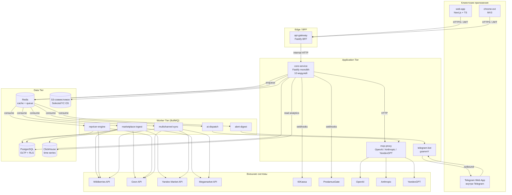
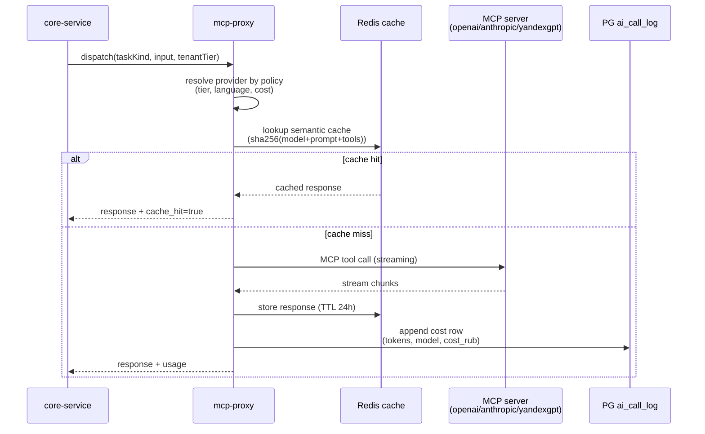
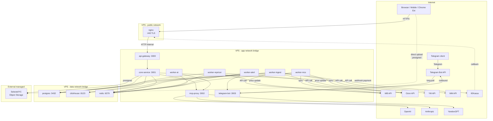

# Architecture — easycomm-world

> SPARC Phase: **Architecture**
> Status: **Accepted** (proposed by Phase 1, ratified by ADRs in `docs/ADR.md`)
> Inputs: `docs/Product_Discovery_Brief.md` (architecture constraints + product context),
> `docs/research/predecessor-analysis.md` (стек прародителей).
> Companions: `docs/C4_Diagrams.md` (визуализация), `docs/ADR.md` (обоснования).

---

## 1. Архитектурный обзор

### 1.1 Выбранный стиль: Distributed Monolith (Monorepo)

Easycomm-world реализуется как **распределённый монолит в монорепозитории**:

- **Один деплоируемый бэкенд-блок** (`core-service`) с внутренней модульной
  декомпозицией (auth, vault-proxy, connections, products, analytics,
  repricer, ai, multichannel, agency, billing, audit).
- **Отдельные worker-процессы** (BullMQ-consumers), которые делят кодовую
  базу с `core-service`, но запускаются независимо в Docker Compose.
- **Отдельные внешние контейнеры** для специализированных задач:
  `api-gateway` (BFF), `mcp-proxy` (роутер AI-провайдеров),
  `telegram-bot` — каждый со своим жизненным циклом.
- **Frontend-приложения** (`web-app`, `chrome-ext`) — отдельные пакеты
  в монорепе, со своим бандлингом, но общим типизированным API-контрактом
  (`@easycomm/shared-types`).

### 1.2 Почему именно distributed monolith, а не альтернативы

| Альтернатива | Почему НЕ выбрана для MVP |
|---|---|
| **Full monolith** (один процесс, всё внутри) | Долгие задачи (парсинг WB+Ozon+ЯМ+Megamarket, AI-вызовы, репрайсинг 20k SKU) блокировали бы HTTP-цикл. Один OOM-кризис в воркере положил бы UI. |
| **Микросервисы** (по одному per домен) | Команда стартапа на MVP-стадии (3–6 инженеров) не выдержит operational overhead 10+ сервисов; deploy на VPS без managed K8s сделает межсервисную сеть, observability и схемы данных самой большой частью работы. |
| **Serverless** (Lambda / Yandex Cloud Functions) | Нарушает constraint "VPS + Docker Compose". Long-running парсинг и BullMQ-воркеры в FaaS-парадигме дороги и хрупки. |

**Distributed monolith даёт:** shared types, единая миграция БД, один CI/CD
pipeline, простой rollback, и при этом — независимое масштабирование
worker-контейнеров, изолированный fault-domain для AI-прокси, возможность
разнести `web-app` на CDN.

Подробное обоснование — `docs/ADR.md#ADR-001`.

### 1.3 Драйверы архитектуры (что формирует решения)

1. **Security-first vault** (constraint: серверу запрещено держать
   расшифрованные API-ключи маркетплейсов) → весь криптографический
   контракт смещён в браузер (Web Crypto API, AES-GCM, PBKDF2 100k).
2. **Multi-tenancy с двумя уровнями** (tenant = продавец/бренд;
   workspace = клиент агентства внутри tenant=agency) → PostgreSQL RLS +
   tenant_id в каждом запросе.
3. **Time-series характер данных** (исторические цены/позиции/продажи по
   SKU × marketplace × день — наследие Jungle Scout AccuSales и
   Helium 10 Profits Dashboard) → ClickHouse как specialised store.
4. **AI как first-class citizen** через MCP — нужен единый прокси с
   квотами, кэшем и cost ledger, иначе billing AI-функций становится
   неуправляемым.
5. **Чёткий контракт с маркетплейсами** (rate limits WB/Ozon/ЯМ/Megamarket
   агрессивны) → adapter-слой с per-marketplace rate-limit budget и
   общим интерфейсом.

---

## 2. High-Level Architecture Diagram



---

## 3. Component Breakdown

### 3.1 web-app (Next.js 15, App Router)

| Аспект | Значение |
|---|---|
| **Ответственность** | Главное seller-приложение: dashboard, products, analytics, repricer UI, multichannel, agency console, settings. |
| **Технологии** | Next.js 15 (App Router, RSC), TypeScript 5, shadcn/ui, Tailwind, TanStack Query, Zustand, Web Crypto API. |
| **Owns-what-data** | Только клиентский кэш (TanStack Query) + **vault** в IndexedDB (зашифрованные API-ключи). Никакого long-lived состояния на сервере SSR кроме сессии. |
| **Talks-to-whom** | `api-gateway` через HTTPS + JWT в Authorization header. Прямые fetch к marketplace API из браузера (когда vault разлочен) для операций, требующих ключа. |
| **Scaling pattern** | Stateless. Деплой через standalone build, отдача статики из nginx-контейнера. Горизонтальное масштабирование тривиально (CDN перед статикой, sticky-session не нужны). |

### 3.2 chrome-ext (Chrome Extension Manifest V3)

| Аспект | Значение |
|---|---|
| **Ответственность** | Wedge для нового пользователя (наследие Jungle Scout): анализ карточек прямо на WB/Ozon, "import card" в личный кабинет, free-tier overlay с метриками ниши. |
| **Технологии** | MV3 (background service worker), TypeScript, React в content-script через Shadow DOM, общий `@easycomm/shared-types`. |
| **Owns-what-data** | Локальный sync-storage расширения (не vault — только UI-настройки). Auth-токен берётся через native-messaging с web-app по OAuth-style handshake. |
| **Talks-to-whom** | `api-gateway` (read-only public endpoints), DOM страниц WB/Ozon (парсинг карточек). |
| **Scaling pattern** | N/A — клиентское. Версионируется через Chrome Web Store, форсированный auto-update при breaking-change в API. |

### 3.3 api-gateway (Fastify, BFF)

| Аспект | Значение |
|---|---|
| **Ответственность** | Edge-роутинг, JWT-верификация, rate-limit per-tenant, CORS, request-ID propagation, request/response shaping для разных клиентов (web vs ext vs telegram-web-app). |
| **Технологии** | Fastify 4, `@fastify/jwt`, `@fastify/rate-limit` (Redis-backed), pino. |
| **Owns-what-data** | Stateless. Сессии — JWT (RS256, 15 min access + 7 day refresh, refresh — в HttpOnly cookie). |
| **Talks-to-whom** | Только `core-service` (по internal HTTP в Docker network), Redis (rate-limit). |
| **Scaling pattern** | Stateless, любое число реплик. Горизонтальное масштабирование за nginx-балансировщиком. На MVP — 1 инстанс. |

### 3.4 core-service (Fastify modular monolith)

| Аспект | Значение |
|---|---|
| **Ответственность** | Бизнес-логика всех 10 доменных модулей (см. §4). Единственный writer для PostgreSQL. Постановщик задач в BullMQ. Координатор RLS-контекста. |
| **Технологии** | Node.js 22 LTS, TypeScript 5, Fastify 4, Prisma 5 (с RLS-extension), zod для контрактов, OpenAPI 3.1 auto-gen. |
| **Owns-what-data** | Все таблицы PostgreSQL (см. §5). Не пишет напрямую в ClickHouse — только читает агрегаты. |
| **Talks-to-whom** | PG (read+write), Redis (cache + queue producer), CH (read-only aggregates), `mcp-proxy` (HTTP), S3 (presigned URLs). |
| **Scaling pattern** | Stateless по HTTP, но **stateful по миграциям БД** (один инстанс выполняет миграции при старте). MVP — 1–2 реплики; sharding по tenant_id появится только когда single-PG hit лимит ≥ 5000 активных tenant. |

### 3.5 workers (BullMQ consumers)

Все воркеры — отдельные Docker-контейнеры, использующие общий код
`core-service` через workspace-зависимости, но запускающие только
worker-entry-point.

| Worker | Очередь | Что делает | Concurrency |
|---|---|---|---|
| **marketplace-ingest** | `mp:ingest:*` | Pull-инджест данных WB/Ozon/ЯМ/Megamarket (orders, stocks, prices, positions). Cron-trigger каждые 5–60 мин в зависимости от marketplace и tier'а tenant'а. Пишет в PG (transactional) + CH (analytics). | 8 per replica, rate-limit-aware |
| **repricer-engine** | `repricer:run` | Применяет политики ценообразования к SKU (≥50 параметров — наследие Helium 10 + Rithum). Читает текущее состояние из PG, политику из PG, конкурентов из CH, и пишет новые цены через marketplace API. | 4 per replica |
| **ai-dispatch** | `ai:job` | Принимает AI-задачу (генерация описания, keyword research, ниша-analysis), маршрутизирует в `mcp-proxy`, обрабатывает streaming-ответ, сохраняет результат + cost в PG. | 16 per replica |
| **alert-digest** | `alert:*` | Считает алёрты (margin shrink, position drop, OOS), агрегирует в daily digest, отправляет в Telegram через `telegram-bot` или email через провайдера. | 2 per replica |
| **multichannel-sync** | `mcs:*` | Распространение единого описания/остатка/цены на N маркетплейсов одним кликом (наследие Rithum). Обрабатывает conflict resolution. | 4 per replica |

Все воркеры:
- Идемпотентны по `job.id`.
- Имеют explicit retry policy (`attempts: 5`, exponential backoff).
- Логируют structured JSON через pino → docker logs → Loki (Phase 2).

### 3.6 postgres (PostgreSQL 16)

| Аспект | Значение |
|---|---|
| **Ответственность** | OLTP-источник истины: users, tenants, workspaces, products, connections (метаданные, не ключи!), repricer-policies, audit, billing. |
| **Технологии** | PostgreSQL 16, `pgvector` (для будущего семантического поиска ниш), `pg_partman` (партиционирование audit по месяцам). |
| **Owns-what-data** | Все транзакционные сущности. **НЕ** хранит decrypted API-ключи маркетплейсов (их вообще нет на сервере). |
| **Talks-to-whom** | `core-service` (single writer + reader), workers (read+limited write через тот же Prisma-клиент с RLS-контекстом). |
| **Scaling pattern** | MVP: single instance с streaming replica для read-replicas. Phase 2: разнесение audit / billing в отдельный logical-DB. Phase 3: sharding по tenant_id (см. §8). |

### 3.7 clickhouse (ClickHouse 24.x)

| Аспект | Значение |
|---|---|
| **Ответственность** | Time-series метрики по SKU × marketplace × день: price history, position history, sales estimate (AccuSales-style), competitor snapshots. Источник для analytics-дашбордов и repricer-движка. |
| **Технологии** | ClickHouse 24, `MergeTree` engine, партиционирование по `(tenant_id, toYYYYMM(ts))`, TTL 24 месяца с downsampling. |
| **Owns-what-data** | Сырые snapshots с маркетплейсов (immutable), агрегаты (materialized views), AI-генерированные семантические эмбеддинги ниш. |
| **Talks-to-whom** | Workers (write), `core-service` (read-only через дешёвый pooled клиент). |
| **Scaling pattern** | MVP: single node. Phase 2: ZooKeeper-coordinated cluster, шардинг по `cityHash64(tenant_id)`. |

### 3.8 redis (Redis 7)

| Аспект | Значение |
|---|---|
| **Ответственность** | Двойная роль: (a) cache (response cache для analytics-дашбордов, JWT-revocation list, rate-limit counters); (b) очередь BullMQ. |
| **Технологии** | Redis 7, `redis-stack` (для RedisJSON в feature-flags). |
| **Owns-what-data** | Эфемерное состояние. Persistence: AOF + RDB snapshot каждые 5 мин. |
| **Talks-to-whom** | Все backend-сервисы (gateway, core, workers, mcp-proxy). |
| **Scaling pattern** | MVP: single instance. Phase 2: Redis Sentinel (HA), отдельные инстансы для cache vs queue. |

### 3.9 object-storage (S3-compatible)

| Аспект | Значение |
|---|---|
| **Ответственность** | Хранение фото товаров, экспортов отчётов (XLSX/CSV), AI-сгенерированных ассетов, бэкапов БД. |
| **Технологии** | Selectel Object Storage (primary) / Yandex Object Storage (fallback). S3 API. |
| **Owns-what-data** | Бинарные ассеты с tenant_id в префиксе ключа. Presigned URLs для прямой загрузки/выгрузки клиентом (минуя бэкенд). |
| **Talks-to-whom** | `core-service` (issue presigned URLs), `web-app` (direct upload/download), workers (write reports). |
| **Scaling pattern** | Управляемый сервис, scaling прозрачен. Лимит по бюджету (50 ГБ MVP). |

### 3.10 telegram-bot

| Аспект | Значение |
|---|---|
| **Ответственность** | Дневные дайджесты (retention loop — channel #1 в RU), push-уведомления о drop позиций/маржи, mini-app для быстрых действий (одобрение repricer-предложения). |
| **Технологии** | Node.js, grammY framework, long-polling (на MVP) → webhook (Phase 2 с публичным TLS-endpoint). |
| **Owns-what-data** | Связка `telegram_user_id ↔ user_id` в PG. Никакого собственного state. |
| **Talks-to-whom** | Telegram Bot API (egress), `core-service` (для запроса данных юзера при команде), `alert-digest` worker (источник push'ей). |
| **Scaling pattern** | Single instance на MVP (limit Telegram API ≈ 30 msg/sec). Phase 2 — разделение update-handler / sender. |

### 3.11 mcp-proxy

| Аспект | Значение |
|---|---|
| **Ответственность** | Единая точка интеграции AI: routing tool-call'ов в openai-mcp / anthropic-mcp / yandexgpt-mcp по policy (default model per tenant tier, fallback при rate-limit), cost ledger, response cache (semantic cache на эмбеддингах для повторных prompt'ов). |
| **Технологии** | Node.js, native MCP SDK, Redis (semantic cache), PG (cost ledger). |
| **Owns-what-data** | Persistent — таблица `ai_call_log` (PG). Cache — Redis (TTL 24h, key = sha256(model+prompt+tools)). |
| **Talks-to-whom** | `core-service` и `ai-dispatch` worker (inbound). MCP-серверы (egress): OpenAI, Anthropic, YandexGPT. |
| **Scaling pattern** | Stateless. 1 инстанс на MVP, легко горизонтально масштабируется. **Критический failure domain** — изолирован от core, AI-outage не валит весь продукт. |

---

## 4. Module Map внутри core-service

`core-service` — модульный монолит. Каждый модуль:
- Имеет свой Fastify-plugin (`/modules/<name>/plugin.ts`)
- Свой Prisma-namespace (логически — поднабор таблиц)
- Свой набор route-prefix'ов (`/api/v1/<module>`)
- Не импортирует внутренности других модулей напрямую — только через
  exposed-services (внутренний API между модулями).

| # | Модуль | Ответственность | Главные таблицы |
|---|---|---|---|
| 1 | **auth** | Регистрация, login, refresh, MFA (TOTP + опционально WebAuthn), session-revoke. | `users`, `sessions`, `mfa_secrets` |
| 2 | **vault-proxy** | Тонкая прослойка для **публичного ключа** vault'а и проверки proof-of-decryption. **Никогда** не видит plaintext API-ключи маркетплейсов. Хранит зашифрованные blobs vault'а как opaque BYTEA для синхронизации между устройствами. | `vault_blobs` (opaque ciphertext) |
| 3 | **connections** | CRUD маркетплейс-подключений (метаданные: тип, имя, статус, last-sync). Сами API-ключи живут только в vault. | `marketplace_connections` |
| 4 | **products** | Единый реестр карточек (наследие Rithum). Дедупликация по barcode/EAN. | `products`, `product_variants`, `product_listings` |
| 5 | **analytics** | Дашборды, отчёты, экспорты. Только reader для CH. | (нет своих PG-таблиц, кроме `saved_views`) |
| 6 | **repricer** | Политики ценообразования, dry-run, история применения. | `repricer_policies`, `repricer_runs` |
| 7 | **ai** | AI-задачи (запрос → результат), история, AI-генерируемые drafts. | `ai_tasks`, `ai_drafts`, `ai_call_log` |
| 8 | **multichannel** | Sync-операции "распространить на N маркетплейсов". | `sync_jobs`, `sync_conflicts` |
| 9 | **agency** | Agency workspaces, инвайты клиентов, права. | `workspaces`, `workspace_members`, `client_access_grants` |
| 10 | **billing** | Tier, подписка, ЮKassa/Prodamus webhooks, AI-quota tracking. | `subscriptions`, `invoices`, `quota_usage` |
| 11 | **audit** | Immutable audit log всех действий пользователя/системы. | `audit_log` (партиции по месяцам) |

> Audit формально 11-й модуль, но он — **cross-cutting** через
> Fastify-hook. Все остальные модули пишут в него декларативно.

---

## 5. Technology Stack Table (с обоснованием)

| Слой | Технология | Альтернатива | Почему именно эта |
|---|---|---|---|
| Frontend framework | Next.js 15 (App Router) | Remix, Nuxt | RSC ↓ TTFB для analytics-дашбордов; огромная экосистема Russian-friendly UI-китов; первоклассная TS-поддержка; стандарт для Russian SaaS-стартапов 2025. См. ADR-002. |
| UI kit | shadcn/ui + Tailwind | Mantine, AntD | Owned-source компоненты (нет vendor lock-in), кастомизация без battle с темизатором, отличная a11y из коробки. |
| Frontend state | TanStack Query + Zustand | Redux Toolkit, Jotai | Query — server cache; Zustand — UI-state. Чёткое разделение — нет "global redux store". |
| Frontend crypto | Web Crypto API (native) | sjcl, libsodium-js | Browser-native, не bloat'ит bundle, hardware-acceleration. |
| Chrome ext | MV3 | MV2 | Forced timeline 2024 — MV2 deprecated в Chrome. |
| Backend runtime | Node.js 22 LTS | Bun, Deno | Стабильность LTS, экосистема BullMQ/Prisma полностью совместима; Bun на 2026 ещё не достаточно battle-tested под Fastify. |
| Web framework | Fastify 4 | NestJS, Express, Hono | Скорость, schema-driven validation (zod-to-json-schema), нет magic-decorators NestJS; Hono пока без production-grade plugins. См. ADR-003. |
| ORM | Prisma 5 | Drizzle, Kysely, raw SQL | Schema-first, migration management, type-safe; trade-off — runtime query engine ↓ raw performance, но мы пишем не больше 200 q/s на MVP. |
| Background jobs | BullMQ | RabbitMQ, Kafka, Temporal | Redis-only (нет нового инфра-зверя), отличный TS-API, поддержка delayed/cron/priority. См. ADR-006. |
| OLTP DB | PostgreSQL 16 | MySQL, CockroachDB | RLS для multitenancy, pgvector, JSONB, отличная Russian DBA-поддержка (Postgres Pro). См. ADR-009. |
| Time-series | ClickHouse 24 | TimescaleDB, InfluxDB | Кратно дешевле по storage за тот же объём snapshots; столбцовое сжатие до 10× для price/position снимков; русскоязычная open-source community. См. ADR-004. |
| Cache + queue | Redis 7 | KeyDB, Dragonfly | Industry standard, BullMQ requires Redis API; persistence настраиваема. |
| Object storage | Selectel OS / YC OS | own MinIO | Российский провайдер (152-ФЗ), S3-compatible API, минимизируем ops; MinIO потребует HA-кластер. |
| Containers | Docker + Docker Compose | K8s, Nomad | VPS-deploy без managed K8s; Compose покрывает 0–10k tenant. См. ADR-008. |
| AI integration | MCP servers (openai-mcp, anthropic-mcp, yandexgpt-mcp) | Direct SDK calls | Унификация tool-protocol, switchable providers, лучшее cost-tracking. См. ADR-007. |
| Payments | ЮKassa (primary) + ProdamusGate (fallback for ИП) | Stripe, Robokassa | Российские реалии: ЮKassa — самый большой охват юр.лиц; Prodamus — лучший acquiring для ИП. См. ADR-012. |
| Email | Unisender / SendPulse | SendGrid, Mailgun | Российские провайдеры с подписанием 152-ФЗ. |
| Notifications primary | Telegram Bot API | Email, SMS, WhatsApp | RU-рынок — Telegram > email для seller'ов; SMS дорого; WhatsApp Cloud API недоступен. См. ADR-011. |

---

## 6. Data Architecture

### 6.1 ER-диаграмма (core 18 entities)

```mermaid
erDiagram
    USER ||--o{ SESSION : owns
    USER ||--o{ MFA_SECRET : owns
    USER ||--o{ TENANT_MEMBERSHIP : "is member of"
    TENANT ||--o{ TENANT_MEMBERSHIP : has
    TENANT ||--o{ WORKSPACE : contains
    WORKSPACE ||--o{ WORKSPACE_MEMBER : has
    USER ||--o{ WORKSPACE_MEMBER : "is in"
    TENANT ||--o{ VAULT_BLOB : "owns ciphertext"
    TENANT ||--o{ MARKETPLACE_CONNECTION : has
    MARKETPLACE_CONNECTION ||--o{ PRODUCT_LISTING : "exposes"
    TENANT ||--o{ PRODUCT : has
    PRODUCT ||--o{ PRODUCT_VARIANT : has
    PRODUCT_VARIANT ||--o{ PRODUCT_LISTING : "is listed as"
    TENANT ||--o{ REPRICER_POLICY : configures
    REPRICER_POLICY ||--o{ REPRICER_RUN : "executed via"
    PRODUCT_LISTING ||--o{ REPRICER_RUN : "applies to"
    TENANT ||--o{ AI_TASK : initiates
    AI_TASK ||--o{ AI_CALL_LOG : "billed via"
    TENANT ||--o{ SYNC_JOB : initiates
    TENANT ||--|| SUBSCRIPTION : "is on"
    SUBSCRIPTION ||--o{ INVOICE : has
    SUBSCRIPTION ||--o{ QUOTA_USAGE : "tracks"
    TENANT ||--o{ AUDIT_LOG : produces

    USER {
        uuid id PK
        string email UK
        string password_hash
        timestamp created_at
        boolean mfa_enabled
    }
    TENANT {
        uuid id PK
        string slug UK
        string display_name
        enum kind "seller|agency"
        timestamp created_at
    }
    WORKSPACE {
        uuid id PK
        uuid tenant_id FK
        string display_name
        string client_external_id "NULL for tenant=seller"
    }
    MARKETPLACE_CONNECTION {
        uuid id PK
        uuid tenant_id FK
        enum marketplace "wb|ozon|ym|mm"
        string display_name
        string vault_key_ref "pointer in vault blob"
        timestamp last_sync_at
        enum status "active|paused|error"
    }
    VAULT_BLOB {
        uuid id PK
        uuid tenant_id FK
        bytea ciphertext "AES-GCM blob from client"
        bytea iv
        int version
        timestamp updated_at
    }
    PRODUCT {
        uuid id PK
        uuid tenant_id FK
        string barcode UK
        string name
        jsonb attributes
    }
    PRODUCT_VARIANT {
        uuid id PK
        uuid product_id FK
        string sku
        jsonb attributes
    }
    PRODUCT_LISTING {
        uuid id PK
        uuid variant_id FK
        uuid connection_id FK
        string external_id "nm_id, ozon_sku..."
        decimal current_price
        int current_stock
        timestamp synced_at
    }
    REPRICER_POLICY {
        uuid id PK
        uuid tenant_id FK
        string name
        jsonb rules "50+ params"
        boolean enabled
    }
    REPRICER_RUN {
        uuid id PK
        uuid policy_id FK
        uuid listing_id FK
        decimal old_price
        decimal new_price
        timestamp applied_at
        enum status "preview|applied|failed"
    }
    AI_TASK {
        uuid id PK
        uuid tenant_id FK
        enum kind "content|niche|keyword|insight"
        jsonb input
        jsonb output
        enum status
        timestamp created_at
    }
    AI_CALL_LOG {
        uuid id PK
        uuid task_id FK
        string provider "openai|anthropic|yandexgpt"
        string model
        int prompt_tokens
        int completion_tokens
        decimal cost_rub
        timestamp called_at
    }
    SYNC_JOB {
        uuid id PK
        uuid tenant_id FK
        uuid product_id FK
        jsonb target_connections
        enum status
        jsonb conflicts
    }
    SUBSCRIPTION {
        uuid id PK
        uuid tenant_id FK
        enum tier "free|pro|team|agency"
        timestamp current_period_end
        enum status "active|past_due|canceled"
    }
    INVOICE {
        uuid id PK
        uuid subscription_id FK
        decimal amount_rub
        enum provider "yukassa|prodamus"
        string provider_payment_id
        enum status
    }
    QUOTA_USAGE {
        uuid id PK
        uuid subscription_id FK
        enum quota_kind "ai_requests|sku|connections"
        int used
        int limit
        date period
    }
    AUDIT_LOG {
        uuid id PK
        uuid tenant_id FK
        uuid actor_user_id
        string action
        jsonb metadata
        timestamp at
    }
```



### 6.2 Polyglot persistence strategy

| Тип данных | Где живёт | Почему |
|---|---|---|
| Транзакционные сущности (users, tenants, products, policies) | **PostgreSQL** | ACID, foreign keys, RLS. |
| Time-series snapshots (price/position/sales по дням) | **ClickHouse** | Column-store, 10× compression, аналитические запросы на млрд строк за секунды. Наследие Helium 10 Profits Dashboard и Jungle Scout AccuSales mandates time-series store. |
| Hot cache (analytics dashboard responses, JWT revocation, rate-limit counters) | **Redis** | Sub-ms latency, TTL native. |
| BullMQ queues | **Redis** | Часть BullMQ-контракта. |
| Бинарные ассеты (фото, отчёты, бэкапы) | **S3-compat** | Дёшево, scalable, не нагружает БД. |
| Vault ciphertext | **PostgreSQL (BYTEA)** | Сервер хранит как opaque blob — не "база ключей", а "база зашифрованных строк". |
| Semantic embeddings (для ниша-поиска) | **PostgreSQL (pgvector)** на MVP, миграция в ClickHouse при > 10М векторов | Простота на MVP. |

### 6.3 Multitenancy strategy

- **PostgreSQL**: каждый tenant-scoped table содержит колонку `tenant_id UUID NOT NULL`. RLS policy:

  ```sql
  CREATE POLICY tenant_isolation ON products
    USING (tenant_id = current_setting('app.tenant_id')::uuid);
  ```

  Prisma-middleware устанавливает `SET LOCAL app.tenant_id = $1` на каждом
  запросе. Прорыв изоляции невозможен — даже SQL-injection не позволит
  обойти RLS.

- **Agency Mode** (tenant.kind = 'agency'): дополнительный уровень —
  `workspace_id` для каждой клиентской записи. Доступ агентского
  сотрудника гейтится комбинацией tenant_id (RLS) + workspace_id (ABAC).

- **ClickHouse**: партиции по `(tenant_id, toYYYYMM(ts))`. На уровне
  запросов в каждый WHERE подмешивается `WHERE tenant_id = ?` —
  enforced в data-access-layer (нет RLS, но есть единственная query
  surface через `analytics`-модуль).

- **Redis**: namespace через префикс ключа `t:<tenant_id>:...`.

- **S3**: префикс объекта `t/<tenant_id>/...`. Presigned URL'ы — только
  на конкретные объекты, не на список.

Подробное обоснование single-PG-with-RLS vs schema-per-tenant vs
db-per-tenant — `docs/ADR.md#ADR-009`.

### 6.4 Backup / restore strategy

| Слой | Backup | Restore SLA |
|---|---|---|
| PostgreSQL | pg_basebackup + WAL-G в S3 ежедневно, PITR-окно 7 дней | RPO 5 мин, RTO ≤ 2 ч |
| ClickHouse | `BACKUP TABLE` в S3 ежедневно (incremental); FREEZE для partitions | RPO 24 ч, RTO ≤ 6 ч |
| Redis | AOF + RDB snapshot каждые 5 мин в S3 | RPO 5 мин (cache можно восстановить пересчётом) |
| S3 | Версионирование bucket'а + cross-region replication (Selectel + YC) | RPO 0, RTO 30 мин |
| Vault | Не бэкапится отдельно — vault_blobs уже в PG, plaintext key — у пользователя (master password). **Потеря master password = безвозвратная потеря vault** (документировано в onboarding). |

---

## 7. Integration Architecture

### 7.1 Marketplace API adapters pattern

Все интеграции с WB/Ozon/ЯМ/Megamarket реализуют единый TypeScript-интерфейс:

```typescript
interface MarketplaceAdapter {
  marketplace: 'wb' | 'ozon' | 'ym' | 'mm';
  fetchOrders(since: Date, ctx: TenantContext): AsyncIterable<NormalizedOrder>;
  fetchListings(ctx: TenantContext): AsyncIterable<NormalizedListing>;
  updatePrice(externalId: string, price: number, ctx: TenantContext): Promise<UpdateResult>;
  updateStock(externalId: string, stock: number, ctx: TenantContext): Promise<UpdateResult>;
  createListing(payload: CreateListingDTO, ctx: TenantContext): Promise<CreateResult>;
  rateLimitBudget(): RateLimitBudget;
}
```

- **Per-marketplace impl** в `packages/adapters/<mp>` с собственным
  HTTP-клиентом, mapper'ом полей в `Normalized*` (унифицированная модель)
  и rate-limit budget'ом.
- **Rate-limit budget abstraction**: `TokenBucket` per (tenant_id, marketplace).
  Воркер `marketplace-ingest` перед каждым call'ом `tryConsume(cost)` —
  если 0 — кладёт job в delayed queue.
- **Идемпотентность**: всем write-операциям передаётся `idempotency_key =
  hash(tenant_id, action, listing_id, payload)`. Адаптер либо использует
  нативный idempotency-header марекетплейса, либо хранит lookup в Redis
  (TTL 24 ч).

### 7.2 MCP integration pattern



- **Server registry**: `mcp-proxy` держит конфигурацию серверов в
  `config/mcp-servers.yaml` (hot-reload через SIGHUP).
- **Fallback chain**: openai → anthropic при rate-limit/timeout;
  yandexgpt — primary для русскоязычной генерации (152-ФЗ для
  личных данных в prompt'ах).
- **Cost ledger**: каждый call пишет строку в `ai_call_log` с
  `cost_rub = tokens × per_provider_rate`. `billing`-модуль агрегирует
  для quota enforcement.

### 7.3 Webhook ingress

- **ЮKassa**: `POST /webhooks/yukassa` → JWT-style HMAC verify →
  enqueue `billing:webhook` → 200 OK немедленно. Воркер обрабатывает
  асинхронно с idempotency через `webhook_event_id`.
- **Prodamus**: аналогично, `POST /webhooks/prodamus`.
- **Telegram**: phase 2, webhook вместо long-poll, с TLS-pinned URL.
- Все webhook-endpoint'ы открыты только из allow-listed CIDR'ов
  провайдеров (управляется на api-gateway уровне).

---

## 8. Security Architecture

### 8.1 Authentication

- **Primary**: email + master password.
- Master password — **double-purpose**: (a) логин-фактор (через
  argon2id-хеш, проверяется сервером), (b) ключ для PBKDF2 (100k+
  итераций, salt уникален per user), который никогда не покидает
  браузер и используется для AES-GCM ключа vault.
- **MFA**: TOTP (RFC 6238) обязательно для tier Team/Agency,
  опционально для Pro. WebAuthn — Phase 2.
- **Sessions**: JWT (RS256), access 15 мин, refresh 7 дней в HttpOnly+SameSite=Strict cookie.
  Refresh-токен ротируется при использовании (RTR pattern).

### 8.2 Authorization

- **RBAC** на уровне tenant: роли `owner`, `admin`, `member`, `viewer`.
- **ABAC** для Agency Mode: agency-member имеет доступ к конкретным
  `workspace_id` через `client_access_grants` с явными scope'ами
  (`read`, `write`, `repricer`, `multichannel`).
- Policy enforcement: единый `authorize(user, action, resource)`
  middleware в `core-service`, использующий CASL или собственный
  policy-engine.

### 8.3 Client-side vault (формальная гарантия)

Контракт изоляции:

1. Master password **никогда** не передаётся на сервер в plaintext.
   Логин использует SRP-style proof или argon2-хеш, отдельный от
   vault-key.
2. Vault-key = `PBKDF2-SHA256(master_password, user_salt, 100000)`,
   вычисляется только в браузере (Web Worker для не-блокирующей
   деривации).
3. API-ключи маркетплейсов сериализуются в JSON и шифруются:
   `ciphertext = AES-GCM(vault_key, iv, plaintext_json)`.
4. Сервер получает только `(ciphertext, iv, version)` — opaque для
   него BYTEA.
5. **Auto-lock**: vault залочивается через 15 минут неактивности.
   Любая операция, требующая ключа марекетплейса (например, prive
   update в `repricer`-движке), требует разлоченного vault'а.

> **Формальная гарантия**: при компрометации БД сервера злоумышленник
> получает только зашифрованный blob. Без master password
> расшифровка невозможна (AES-GCM 256 + PBKDF2 100k → ≥ 2¹⁰⁰
> guesses required).

Особый случай — **server-side repricer**: для применения цены воркеру
нужен API-ключ. Решение: репрайсер работает только когда vault
разлочен в активной сессии. Браузер передаёт API-ключ в
**short-lived ephemeral credential** (≤ 60 сек), который воркер
использует и сразу сбрасывает. См. подробности в Specification.md.

### 8.4 Audit log immutability

- Таблица `audit_log` партиционирована по месяцам (`pg_partman`).
- Insert-only через триггер: `REVOKE UPDATE, DELETE ON audit_log`.
- Раз в сутки cron-job вычисляет SHA-256 hash chain
  (`hash_n = sha256(row_n || hash_{n-1})`) и пишет последний хеш
  в S3 с object-lock'ом (immutability при WORM-режиме). Это даёт
  криптографическую защиту от подмены постфактум.

### 8.5 Secrets management (server-side)

- Не используются Docker secrets / Vault by HashiCorp на MVP.
- Все серверные секреты (DB creds, JWT signing key, ЮKassa secret,
  MCP-provider tokens) — в `.env` файле, зашифрованном через
  **sops + age** (GitOps-friendly).
- Расшифровка только при `docker compose up` (через `sops -d`).
- Rotation policy: квартальная.

### 8.6 Common attack surface mitigations

| Угроза | Защита |
|---|---|
| Brute-force login | Rate-limit 5/min per IP + 5/min per email + capability-based слаквание (slow-down 10× после 3 failed) |
| Credential stuffing | argon2id (m=64MB, t=3, p=1) для password hash |
| CSRF | SameSite=Strict cookies + double-submit token on state-changing requests |
| XSS | CSP `script-src 'self' 'nonce-...'`; React auto-escaping; sanitize-html для AI-сгенерированного контента |
| SQL injection | Prisma parameterized queries only; raw SQL запрещён ESLint-правилом |
| SSRF (особенно через AI и URL inputs) | Allow-list outbound IPs; mcp-proxy выходит только в whitelisted домены |
| Replay attacks на webhook | Идемпотентность через `event_id` + nonce window 5 мин |

---

## 9. Scalability Considerations

### 9.1 Stateless vs stateful boundaries

| Компонент | Stateless? | Шкалирование |
|---|---|---|
| api-gateway | ✅ да | Любое число реплик |
| core-service | ✅ да (кроме миграций) | 1–8 реплик за nginx |
| workers | ✅ да | По очереди — независимо |
| mcp-proxy | ✅ да | Любое число реплик |
| telegram-bot | ⚠️ semi (long-poll — один владелец) | leader-election через Redis |
| postgres | ❌ нет | Vertical → read-replicas → sharding |
| clickhouse | ❌ нет | Vertical → distributed cluster |
| redis | ❌ нет | Vertical → sentinel HA → cluster |

### 9.2 Sharding plan (когда single-PG станет узким горлышком)

**Триггер**: > 5000 активных tenant'ов, или > 1 TB на одной БД, или
write-load > 10k TPS.

**Стратегия**: shard по `tenant_id` через consistent hash. Решения:
- Application-level sharding (Prisma + custom router) — самое
  предсказуемое, выбрано как default.
- CockroachDB или Citus — не используются (vendor lock-in,
  сложность ops).

**Shard layout (Phase 3, не MVP)**:
- 4 shard'а × 2 replica каждый = 8 PG instances.
- Cross-shard queries запрещены (нет JOIN между tenant'ами — это и
  так не разрешено бизнес-правилом).

### 9.3 ClickHouse cluster plan

**Триггер**: single-node CH не справляется с insert rate (> 500k rows/s)
или query latency p95 > 2 сек.

**Layout**: 3 shards × 2 replicas, ZooKeeper-coordinated, distributed
table поверх `(tenant_id)` хеш-шардинга.

### 9.4 Когда разорвать монолит (и какой модуль первый)

Triggers and priorities:

| Условие | Модуль на отделение | Причина |
|---|---|---|
| AI-стоимость > 30% latency бюджета core | **ai** + `ai-dispatch` → отдельный сервис | Уже семи-отдельный через mcp-proxy; отделение даёт независимый failure domain. |
| Multichannel-sync блокирует core-deploy частыми изменениями | **multichannel** | Нагрузка на разработку, не на runtime — отдельный сервис ↓ deploy contention. |
| Repricer-engine требует независимого scaling per-tenant SLA | **repricer** | Чувствительно к latency (продвинутые tenant'ы платят за near-real-time). |
| Analytics dashboard > 50% read-load core | **analytics** (read-only из CH) | Тривиально отделяется, может стать pure read-replica BFF. |

> Принцип: **не разрывать монолит ради красоты**. Разрывать только
> когда метрика (latency, deploy-time, fault-domain) перестаёт
> удовлетворять SLA.

---

## 10. Deployment Architecture

### 10.1 Single-node VPS deployment (MVP)

Целевой VPS: AdminVPS или HOSTKEY, конфигурация:
- 8 vCPU, 32 GB RAM, 500 GB NVMe.
- Ubuntu 24.04 LTS.
- Docker + Docker Compose v2.
- Nginx как TLS terminator (Let's Encrypt автоматический renew).

`docker-compose.yml` контейнеры:

| Контейнер | Image | Восстановление |
|---|---|---|
| nginx | nginx:alpine | unless-stopped |
| api-gateway | local build | unless-stopped, healthcheck |
| core-service | local build | unless-stopped, healthcheck |
| mcp-proxy | local build | unless-stopped |
| telegram-bot | local build | unless-stopped |
| worker-marketplace-ingest | local build (entrypoint) | unless-stopped |
| worker-repricer-engine | local build (entrypoint) | unless-stopped |
| worker-ai-dispatch | local build (entrypoint) | unless-stopped |
| worker-alert-digest | local build (entrypoint) | unless-stopped |
| worker-multichannel-sync | local build (entrypoint) | unless-stopped |
| postgres | postgres:16-alpine | always |
| clickhouse | clickhouse/clickhouse-server:24 | always |
| redis | redis:7-alpine | always |
| prometheus | prom/prometheus | unless-stopped (Phase 2) |
| grafana | grafana/grafana | unless-stopped (Phase 2) |

### 10.2 Multi-node VPS plan (Phase 2)

- **Node 1 (app)**: nginx, api-gateway × 2, core-service × 2, mcp-proxy × 2, telegram-bot.
- **Node 2 (workers)**: все worker-контейнеры.
- **Node 3 (data)**: postgres (primary) + clickhouse + redis-master.
- **Node 4 (data replica)**: postgres-replica + redis-replica + grafana.

Соединение — приватная сеть провайдера (AdminVPS internal LAN или
WireGuard mesh).

### 10.3 Blue-green deploy via docker-compose

- Два набора файлов: `docker-compose.blue.yml`, `docker-compose.green.yml`.
- nginx upstream указывает на активный set; deploy-скрипт стартует
  inactive set, прогоняет migration check + health-check, переключает
  upstream, останавливает старый set.
- Откат — один SIGHUP nginx'у.
- Миграции БД — **только expand-then-contract** (Prisma migrate
  `expand` → deploy → `contract` следующим релизом).

### 10.4 Почему НЕ Kubernetes (explicit rationale)

| Аргумент против K8s на MVP |
|---|
| Constraint Phase 0: VPS, не managed K8s. Yandex Cloud K8s выходит за бюджет. |
| Self-hosted k3s/rke2 даст +1 уровень ops сложности (control plane upgrades, etcd backups, networking troubleshooting), без бизнес-выгоды для 0–500 tenant. |
| Docker Compose покрывает 100% потребностей до 10k tenant: rolling deploy через blue-green, healthchecks, restart policies, networks. |
| Перенос на K8s в будущем — straightforward: `kompose convert` + tweak. Не дешевле сразу делать на K8s. |

Подробное обоснование — `docs/ADR.md#ADR-008`.

---

## 11. Network / Topology Diagram



**Сетевые правила (Docker networks)**:

- `app_net`: nginx, api-gateway, core-service, mcp-proxy, telegram-bot, workers. Internal only.
- `data_net`: postgres, clickhouse, redis + core-service, workers. Internal only.
- `public`: только nginx с port-mapping `443:443`, `80:80`.
- Firewall (`ufw`): на хосте открыты 22 (SSH с key-only + fail2ban), 80, 443. Всё остальное — drop.
- Outbound TLS: разрешён всем app-сервисам, но `mcp-proxy` имеет
  egress allow-list (только API хосты OpenAI/Anthropic/YandexGPT).

---

## 12. Cross-references

| Тема | Документ |
|---|---|
| Архитектурные решения с альтернативами | `docs/ADR.md` |
| C4-визуализация (Context/Container/Component/Code) | `docs/C4_Diagrams.md` |
| Functional & non-functional requirements | `docs/Specification.md` (будущая фаза) |
| Реализация alg-ов repricer / ingest / sync | `docs/Pseudocode.md` (будущая фаза) |
| Test strategy / refinement | `docs/Refinement.md` (будущая фаза) |
| Definition of Done / launch checklist | `docs/Completion.md` (будущая фаза) |

---

*Конец Architecture.md*
