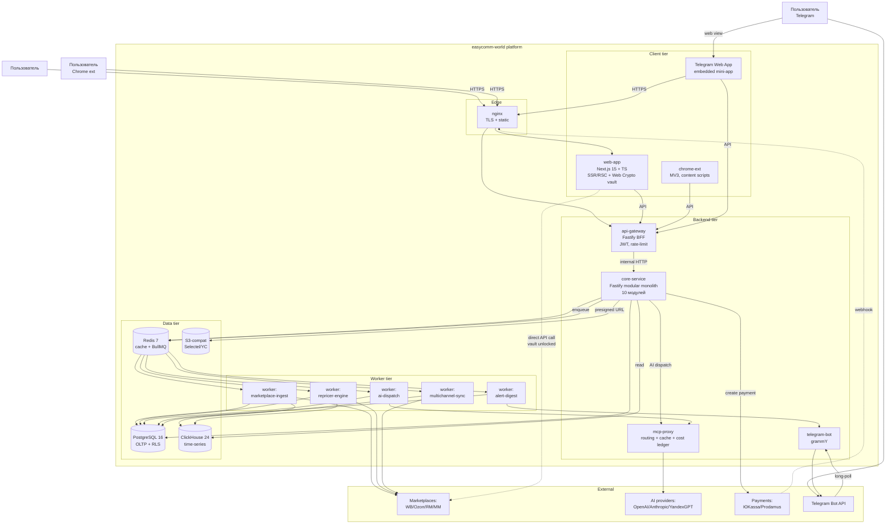
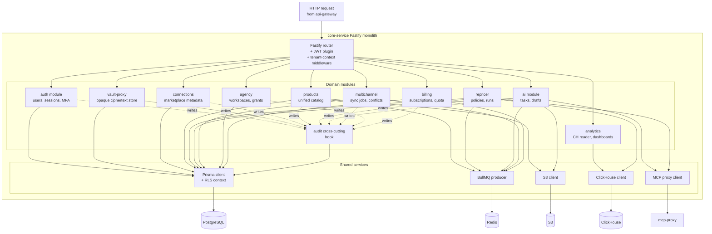
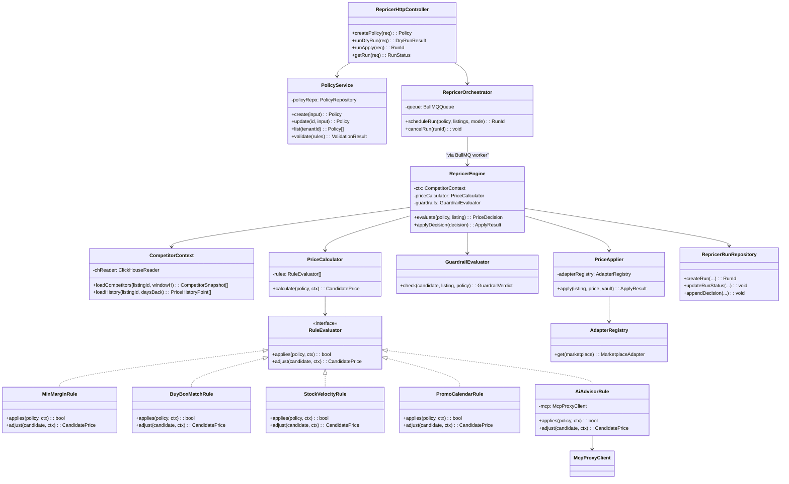
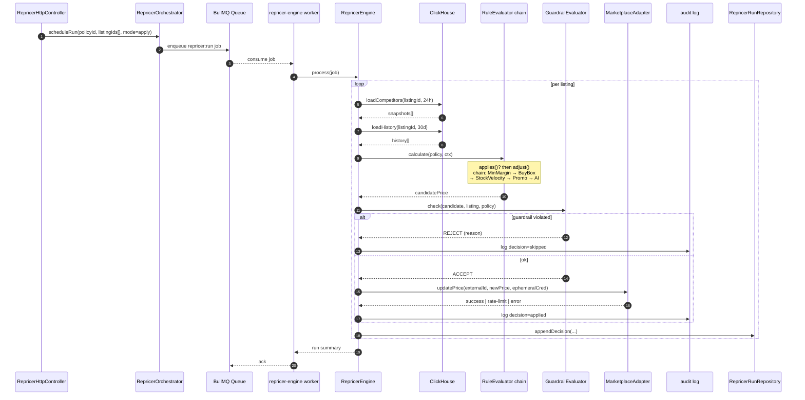

```mermaid
graph TB
    subgraph "Пользователи"
        SELLER[Mid-size seller<br/>1-10 SKU, 1-20 млн ₽/мес]
        BRAND[Brand / производитель<br/>50+ SKU]
        AGENCY_LEAD[Agency lead<br/>владелец marketplace-агентства]
        AGENCY_CLIENT[Agency client<br/>магазин под управлением]
        SOLO[Solo seller / новичок<br/>free tier]
    end

    SYS([easycomm-world<br/>SaaS платформа для продавцов<br/>WB / Ozon / ЯМ / Megamarket])

    subgraph "Российские маркетплейсы"
        WB[Wildberries Seller API]
        OZ[Ozon Partner API]
        YM[Yandex.Market Partner API]
        MM[Megamarket Partner API]
    end

    subgraph "Платежи & уведомления"
        YK[ЮKassa<br/>primary acquirer]
        PROD[ProdamusGate<br/>ИП-fallback acquirer]
        TG[Telegram Bot API]
        EMAIL[Unisender / SendPulse]
    end

    subgraph "AI-провайдеры через MCP"
        OPENAI[OpenAI<br/>gpt-4o, content gen]
        ANTH[Anthropic<br/>Claude, insights]
        YGPT[YandexGPT<br/>RU-language gen]
    end

    subgraph "Прочие внешние"
        REVS[Yandex Reviews API<br/>отзывы для агрегации]
        S3PROV[Selectel / YC<br/>S3 object storage]
    end

    SELLER -->|web UI + Chrome ext| SYS
    BRAND -->|web UI| SYS
    AGENCY_LEAD -->|agency console| SYS
    AGENCY_CLIENT -->|guest view through agency| SYS
    SOLO -->|Chrome ext free tier| SYS

    SYS -->|read+write API| WB
    SYS -->|read+write API| OZ
    SYS -->|read+write API| YM
    SYS -->|read+write API| MM
    SYS -->|payments + webhook| YK
    SYS -->|payments + webhook| PROD
    SYS -->|push notifications| TG
    SYS -->|transactional email| EMAIL
    SYS -->|AI tool-calls via MCP| OPENAI
    SYS -->|AI tool-calls via MCP| ANTH
    SYS -->|AI tool-calls via MCP| YGPT
    SYS -->|read reviews| REVS
    SYS -->|store blobs| S3PROV
```

# C4 Diagrams — easycomm-world

> Companion to `docs/Architecture.md`. Four levels of decomposition по
> модели C4 (Simon Brown): **Context → Container → Component → Code**.
> Code-level раскрыт для критического компонента — **Repricer Engine**.

---

## Level 1 — System Context

### Diagram

### Description

easycomm-world — **многотенантная SaaS-платформа** для продавцов
российских маркетплейсов с opt-in agency-режимом. Пять групп пользователей,
четыре маркетплейса, три AI-провайдера через MCP, два payment-acquirer'а,
два уведомительных канала (Telegram primary, email secondary).

**Key principle of the context:** API-ключи маркетплейсов вводятся
пользователем и **никогда не покидают браузер в plaintext** (зашифрованный
vault — см. Architecture §8.3). Это формирует границу доверия:
маркетплейс-API доступен либо из браузера (когда vault разлочен), либо из
worker'а с ephemeral-credential (≤ 60 сек).

### Key Interactions (Level 1)

| От → К | Назначение | Протокол | Чувствительность |
|---|---|---|---|
| User → SYS | Daily ops, аналитика, repricing, multichannel | HTTPS + JWT | High (бизнес-данные) |
| SYS → WB/Ozon/ЯМ/MM | Pull orders/listings, push price/stock | REST + Bearer (API key пользователя) | Critical (API ключ) |
| SYS → ЮKassa | Создание платежа, проверка статуса | REST + HMAC | High (PCI scope minimal) |
| ЮKassa → SYS | Payment webhook | HTTPS POST + HMAC sign | High |
| SYS → Telegram Bot API | Дайджесты, alerts | HTTPS + bot-token | Medium |
| SYS → MCP providers | AI tool-calls | MCP over HTTPS + provider token | High (prompt content) |
| User → SYS | Chrome ext: read-only анализ карточек | HTTPS + JWT (public endpoints) | Low |

---

## Level 2 — Container Diagram

### Diagram

### Description

Контейнерный уровень декомпозирует SYS на 14 контейнеров (см. Architecture
§3 для подробного per-container breakdown):

- **3 client containers**: web-app, chrome-ext, Telegram Web App.
- **1 edge**: nginx.
- **4 backend containers**: api-gateway, core-service, mcp-proxy, telegram-bot.
- **5 worker containers**: marketplace-ingest, repricer-engine, ai-dispatch,
  alert-digest, multichannel-sync.
- **4 data containers**: PostgreSQL, ClickHouse, Redis, S3 (managed external).

**Notable architectural choice**: пунктирная стрелка `WEB -.-> MP` —
прямой browser-to-marketplace call, когда vault разлочен. Это позволяет
выполнять чувствительные операции (price update, listing edit) **без
передачи API-ключа на сервер**. Для длинных background-операций
(массовый repricing) браузер выдаёт worker'у short-lived ephemeral
credential.

### Key Interactions (Level 2)

| Контейнер источник → приёмник | Протокол | Назначение | Sync/Async |
|---|---|---|---|
| web-app → api-gateway | HTTPS + JWT | REST queries/mutations | Sync |
| chrome-ext → api-gateway | HTTPS + JWT (limited scope) | Анализ карточек, free-tier | Sync |
| api-gateway → core-service | HTTP (docker network) | Internal RPC | Sync |
| core-service → mcp-proxy | HTTP | AI tool dispatch | Sync (streaming) |
| core-service → PostgreSQL | TCP + TLS optional | OLTP read/write | Sync |
| core-service → Redis | TCP | Cache + enqueue | Sync |
| core-service → ClickHouse | TCP/HTTP | Analytics read | Sync |
| core-service → S3 | HTTPS | Presigned URL issuance | Sync |
| core-service → Redis (queue) | TCP | Job enqueue | Async (fire-and-forget) |
| workers → Redis (queue) | TCP | Job consume | Async |
| workers → marketplaces | HTTPS | Pull/push data | Sync (per call), async overall |
| workers → ClickHouse | TCP/HTTP | Bulk insert snapshots | Async |
| telegram-bot → Telegram API | HTTPS (long-poll) | Receive updates / send messages | Async |
| ЮKassa → nginx → core-service | HTTPS POST | Payment webhook | Async |
| web-app → marketplace API | HTTPS + bearer | Direct write with unlocked vault | Sync |

---

## Level 3 — Component Diagram (core-service)

### Diagram

### Description

`core-service` декомпозируется на **10 доменных модулей** + 1 cross-cutting
(audit) + **5 shared services**.

**Правила модуляризации**:

1. Каждый модуль — отдельный Fastify-plugin (`/modules/<name>/plugin.ts`),
   регистрируется в root-app с уникальным prefix.
2. Модули **не импортируют** внутренности друг друга. Если модулю `B`
   нужны данные от `A` — он использует `A.exposedService` (тонкий
   typed interface).
3. Все модули используют общий `PRISMA`-инстанс, но с RLS-контекстом,
   установленным per-request через middleware
   (`SET LOCAL app.tenant_id`).
4. Audit-модуль работает как **Fastify onResponse-hook**: все
   `state-changing` маршруты автоматически логируют action+actor в
   `audit_log`. Доменный модуль явно вызывает `audit.attach(metadata)`
   для обогащения.

**Communication patterns**:

- **HTTP intra-module**: запрещено (только Fastify-router → module).
- **Direct service calls**: разрешено через `exposedService` (TS interface).
- **Async fan-out**: через BullMQ queue (producer в `core-service`,
  consumer в воркере).

### Component Responsibilities

| Модуль | Routes (примеры) | Exposed services |
|---|---|---|
| auth | `POST /auth/login`, `/refresh`, `/mfa/setup` | `auth.verifyToken(jwt)`, `auth.requireMfa(userId)` |
| vault-proxy | `GET /vault/blob`, `PUT /vault/blob` (opaque) | — (нет cross-module use) |
| connections | `CRUD /connections` | `connections.list(tenantId)`, `connections.getMeta(id)` |
| products | `CRUD /products`, `POST /products/import` | `products.findByBarcode(...)`, `products.bulkUpdate(...)` |
| analytics | `GET /analytics/dashboard/:id`, `POST /analytics/export` | `analytics.snapshotFor(skuId, range)` |
| repricer | `CRUD /repricer/policies`, `POST /repricer/dry-run` | `repricer.applyPolicy(policyId, listingId)` |
| ai | `POST /ai/task`, `GET /ai/drafts` | `ai.dispatch(kind, input)` |
| multichannel | `POST /multichannel/sync`, `GET /multichannel/conflicts` | `multichannel.replicateTo(productId, targets)` |
| agency | `CRUD /workspaces`, `POST /workspaces/:id/invite` | `agency.canAccess(userId, workspaceId, scope)` |
| billing | `GET /billing/subscription`, `POST /billing/upgrade`, `/webhooks/yukassa` | `billing.checkQuota(tenantId, quotaKind)` |
| audit | (no public routes) | `audit.attach(metadata)`, hook-based |

---

## Level 4 — Code-level: Repricer Engine

The Repricer Engine — самый сложный per-tenant модуль (наследие
Helium 10 Repricer + Rithum Dynamic Pricing). Раскрыт на code-level
для двух причин: (a) демонстрация уровня детализации, (b) самый
рискованный bottleneck по latency и stat-correctness.

### 4.1 Code-level diagram (classes/modules внутри repricer)

### 4.2 Detailed flow: один цикл repricer run

### 4.3 Description

- **Rule chain** реализует Strategy pattern. Каждое правило — separate
  class implementing `RuleEvaluator`. Порядок и параметры — в
  `policy.rules` JSONB. Это даёт **>50 параметров** репрайсера
  (унаследовано от Helium 10 Repricer scope) без жёсткого кода: новые
  правила добавляются как новые классы, регистрируются в
  `PriceCalculator.register(rule)`.

- **GuardrailEvaluator** — обязательный sanity-check **после** правил:
  - не падает ниже `min_price_floor`
  - не превышает `max_price_ceiling`
  - не выходит за `± max_delta_percent_per_run` от текущей цены
  - не меняет цену если `last_change_at < cooldown_period`

  Guardrail-violations никогда не применяются — они логируются, но
  возвращают `REJECT`.

- **AiAdvisorRule** — единственное правило, выходящее во вне через
  `mcp-proxy`. Latency budget ≤ 800 мс/listing; при превышении правило
  возвращает "abstain", run продолжается без AI-вклада.

- **PriceApplier** не имеет прямого доступа к API-ключам. Вместо этого
  получает `EphemeralCredential` через short-lived токен от vault'а
  (см. Architecture §8.3). Если ephemeral expired — run помечается как
  `requires_unlock` и ожидает повторного разлоч-эвента.

- **RepricerRunRepository** пишет в PG таблицы `repricer_runs` +
  `repricer_run_items`. Audit-таблица обновляется через cross-cutting
  hook (см. L3 диаграмму).

### 4.4 Non-functional thresholds

| Метрика | Целевое значение (MVP) | Откуда |
|---|---|---|
| Latency на 1 listing (без AI) | p95 ≤ 250 мс | Бизнес-цель: 1000 listings за ≤ 5 мин |
| Latency на 1 listing (с AiAdvisor) | p95 ≤ 1.2 сек | AI is on the critical path |
| Throughput | 1000 listings/мин per worker replica | Pro-tier: 200 SKU за 12 сек |
| Idempotency | Same (policy_id, listing_id, snapshot_hash) → identical decision | Required для повторных runs |
| Rate-limit awareness | Никогда не превысить 80% бюджета маркетплейса | Защищает основной канал ingest |

> *Note: точные пороги будут зафиксированы в `docs/Specification.md` (NFR);
> здесь приведены working assumptions для архитектурного контракта.*

### 4.5 Key Interactions (Level 4)

| Источник → приёмник | Метод | Назначение |
|---|---|---|
| Controller → PolicyService | `create`, `update`, `validate` | CRUD политик |
| Controller → Orchestrator | `scheduleRun` | Запуск run'а |
| Orchestrator → BullMQ | `enqueue` | Async dispatch |
| Worker → Engine | `process(job)` | Main loop |
| Engine → CompetitorContext | `loadCompetitors`, `loadHistory` | Сбор контекста |
| Engine → PriceCalculator → RuleEvaluator[] | `calculate` → `applies`+`adjust` | Strategy chain |
| Engine → GuardrailEvaluator | `check` | Sanity gate |
| Engine → PriceApplier → AdapterRegistry → MarketplaceAdapter | `apply` → `updatePrice` | Внешний effect |
| Engine → audit, RepricerRunRepository | `log`, `appendDecision` | Persistence |

---

## Summary table — Level coverage

| Level | Что показано | Кол-во элементов |
|---|---|---|
| L1 Context | 5 user groups, 1 system, 9 external | 15 nodes |
| L2 Container | 14 containers + external | 14 containers |
| L3 Component (core-service) | 10 modules + audit + 5 services | 16 components |
| L4 Code (repricer) | 14 classes, 1 sequence | 14 classes |

---

*Конец C4_Diagrams.md*
