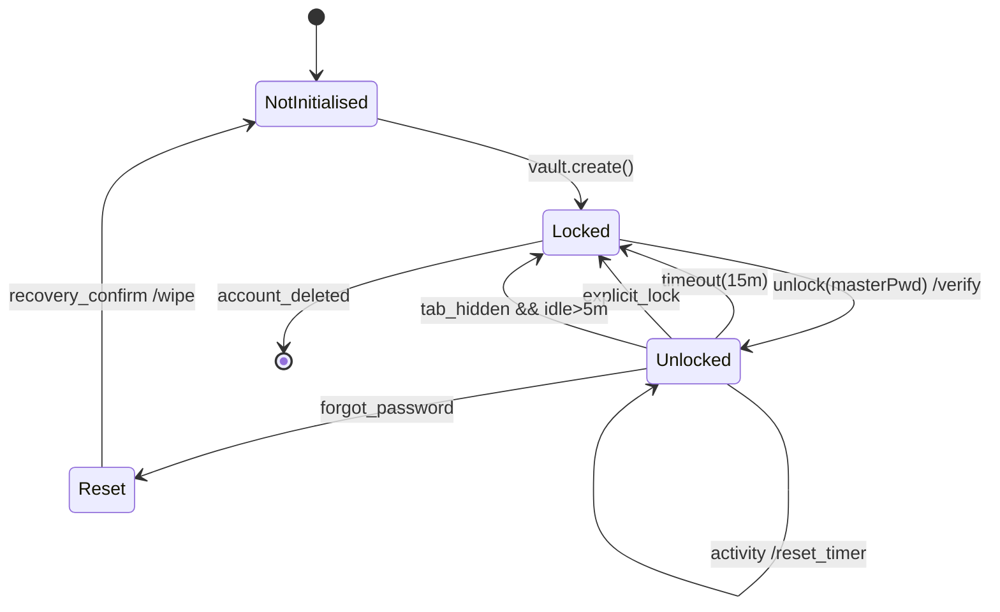
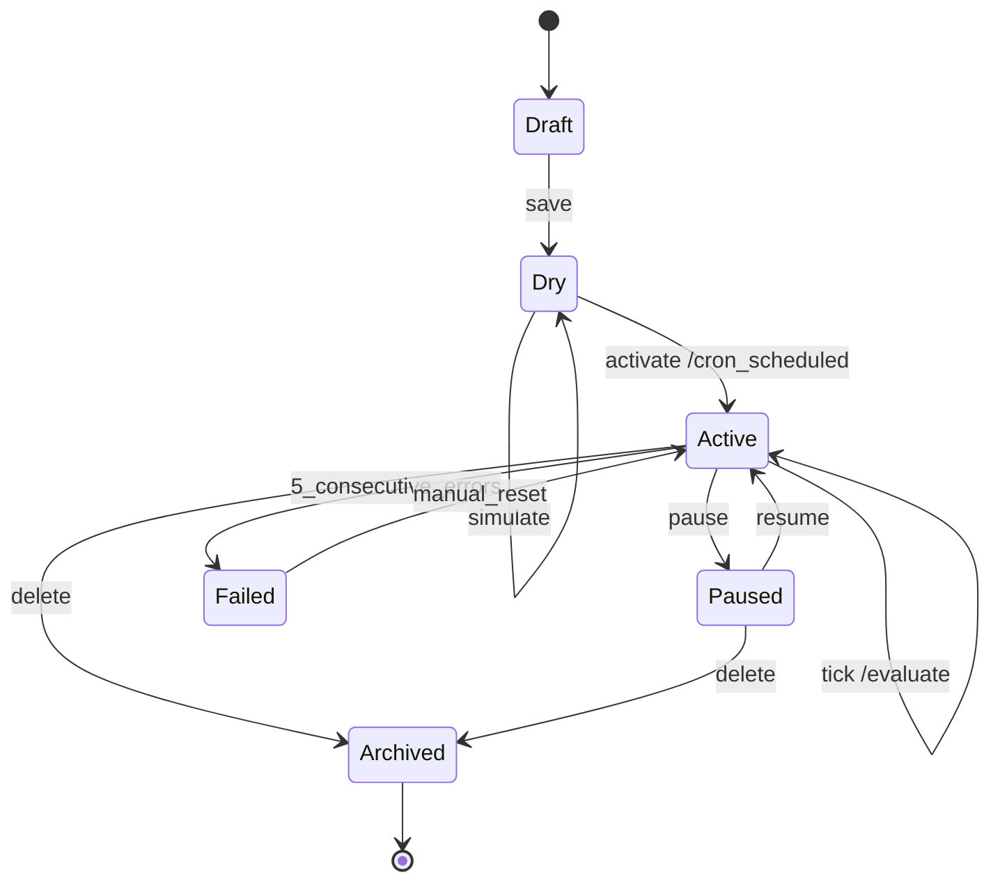
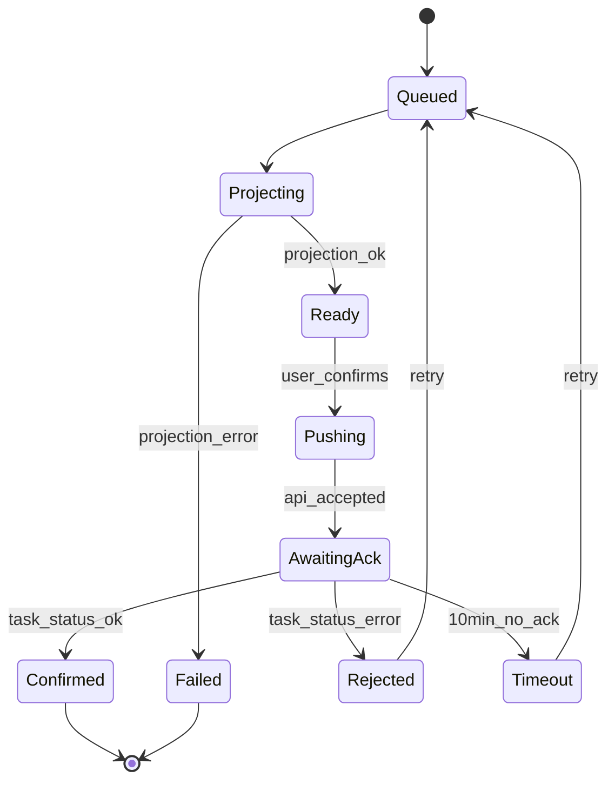
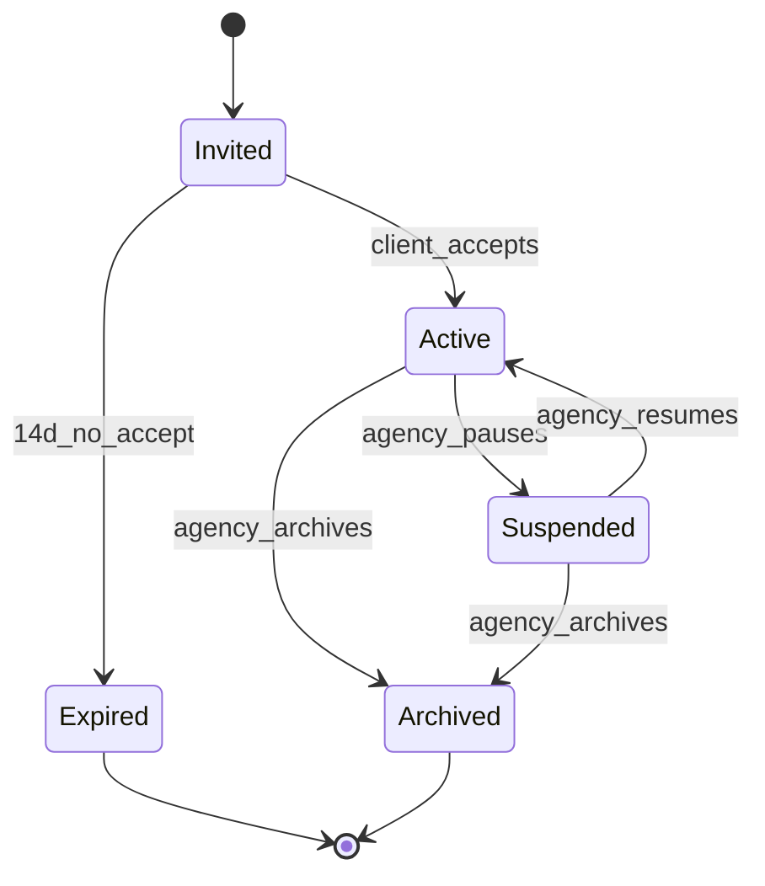

# Pseudocode — easycomm-world

> SPARC Phase 1 artifact. Algorithms, data structures, API contracts, state
> machines and error-handling strategy. Reference for Architecture.md and
> implementation planning.

---

## 1. Data Structures (TypeScript-style)

### 1.1 Identity & Tenancy

```ts
type TenantMode = 'solo' | 'agency';
type UserRole  = 'owner' | 'admin' | 'analyst' | 'operator' | 'client';
type Tier      = 'free' | 'pro' | 'team' | 'agency';

interface Tenant {
  id: string;                       // UUID v4
  name: string;
  mode: TenantMode;
  tier: Tier;
  ownerId: string;                  // FK -> User.id
  region: 'ru-1' | 'ru-2';          // 152-ФЗ data residency
  createdAt: Date;
  features: Record<string, boolean>; // feature flags
}

interface User {
  id: string;
  email: string;                    // RFC 5322
  passwordHash: string;             // bcrypt cost 12 (server-side, *not* vault key)
  tenantId: string;
  role: UserRole;
  twoFactorEnabled: boolean;
  twoFactorSecret?: string;         // encrypted at rest via DB-level KMS
  status: 'pending' | 'active' | 'suspended' | 'deleted';
  createdAt: Date;
  lastLoginAt?: Date;
}

interface Workspace {              // agency-mode only; for solo tenant = tenant itself
  id: string;
  tenantId: string;                 // owning agency tenant
  clientUserId?: string;            // client-role user assigned to workspace
  name: string;
  status: 'pending' | 'active' | 'archived';
  permissions: PermissionScope[];   // see RBAC
  createdAt: Date;
}

type PermissionScope =
  | 'analytics:read' | 'analytics:write'
  | 'repricer:read'  | 'repricer:write'
  | 'cards:read'     | 'cards:write'
  | 'billing:read'   | 'billing:write'
  | 'ai:invoke'      | 'connections:manage';
```

### 1.2 Vault

```ts
interface EncryptedVault {
  id: string;
  userId: string;
  algorithm: 'AES-GCM-256';
  kdf: 'PBKDF2-SHA256';
  kdfSalt: Uint8Array;              // 16 bytes random
  kdfIterations: number;            // ≥ 100_000
  iv: Uint8Array;                   // 12 bytes per AES-GCM
  ciphertext: Uint8Array;
  hmac: Uint8Array;                 // HMAC-SHA256 over (header || ciphertext)
  version: number;                  // monotonic; prevents rollback
  updatedAt: Date;
}

// In-memory only, never persisted
interface VaultSession {
  key: CryptoKey;
  lockTimer: NodeJS.Timeout;
  state: 'locked' | 'unlocked';
  lastActivityAt: number;           // performance.now()
}

interface VaultRecord {             // payload structure decrypted client-side
  secrets: Record<string, EncryptedSecret>;
  meta: { schemaVersion: number };
}

interface EncryptedSecret {
  alias: string;                    // e.g. "wb-token-main"
  marketplace: 'wb' | 'ozon' | 'ya' | 'megamarket' | 'mcp' | 'billing';
  payload: string;                  // the actual token/key
  rotatedAt: Date;
}
```

### 1.3 Marketplace Integration

```ts
type MarketplaceCode = 'wb' | 'ozon' | 'ya' | 'megamarket';

interface MarketplaceConnection {
  id: string;
  tenantId: string;
  workspaceId?: string;
  marketplace: MarketplaceCode;
  alias: string;                    // user-friendly name
  vaultSecretAlias: string;         // points to EncryptedSecret.alias
  status: 'active' | 'expired' | 'error' | 'paused';
  lastHealthyAt?: Date;
  lastErrorMessage?: string;
  rateLimitBudget: number;          // current bucket fill (req)
  createdAt: Date;
}

interface Product {                 // master SKU (canonical)
  id: string;
  tenantId: string;
  workspaceId?: string;
  masterSku: string;                // tenant-internal canonical id
  title: string;
  brand?: string;
  attributes: Record<string, unknown>;
  media: MediaAsset[];
  cogs?: number;                    // cost of goods sold in ₽
  createdAt: Date;
  updatedAt: Date;
}

interface MediaAsset {
  type: 'photo' | 'video' | '360';
  url: string;
  width?: number;
  height?: number;
  position: number;
}

interface MarketplaceListing {
  id: string;
  productId: string;                // FK -> Product
  marketplace: MarketplaceCode;
  connectionId: string;
  externalId: string;               // WB nmId / Ozon product_id / ЯМ offerId
  externalSku?: string;             // user-defined per marketplace
  status: 'active' | 'inactive' | 'rejected' | 'archived';
  url: string;
  lastSyncedAt: Date;
}

interface PriceHistoryPoint {       // ClickHouse: time-series
  tenantId: string;
  listingId: string;
  ts: Date;
  price: number;
  discountedPrice?: number;
  competitorMedian?: number;
  source: 'api' | 'parse';
}

interface SalesEstimate {
  productId?: string;
  externalUrl?: string;             // for competitor SKU
  marketplace: MarketplaceCode;
  windowDays: 30;
  estimatedUnits: number;
  confidence: number;               // 0..1
  reasoning: string;                // human-readable trace
  computedAt: Date;
}

interface KeywordRanking {          // ClickHouse: time-series
  tenantId: string;
  listingId: string;
  keyword: string;
  ts: Date;
  position: number;                 // 1..N (1 = top)
  frequency: number;                // monthly search volume estimate
  relevance: number;                // 0..1
}
```

### 1.4 Repricer

```ts
type RepricerTargetMode =
  | 'match_min'   | 'match_min_minus' | 'match_avg' | 'match_max'
  | 'percent_below_median' | 'fixed_margin' | 'time_decay';

interface PriceRule {
  id: string;
  tenantId: string;
  workspaceId?: string;
  name: string;
  scope: { listingIds?: string[]; categoryIds?: string[]; };
  competitorSelectors: CompetitorSelector[];
  targetMode: RepricerTargetMode;
  targetParams: Record<string, number>;  // e.g. { delta_rub: -1 }
  marginFloorPct: number;           // hard floor
  ceilingRub?: number;
  maxChangeRatePctPerHour: number;
  cronExpr: string;                 // e.g. "*/15 * * * *"
  status: 'dry' | 'active' | 'paused';
  createdAt: Date;
  updatedAt: Date;
}

interface CompetitorSelector {
  type: 'url' | 'category_top_n';
  ref: string;                       // URL or category id
  n?: number;                        // for category_top_n
}

interface RepricerAction {           // audit row
  id: string;
  ruleId: string;
  listingId: string;
  ts: Date;
  fromPrice: number;
  toPrice: number;
  reason: string;                    // human readable
  competitorsSnapshot: { price: number; sku: string }[];
  marketplaceTaskId?: string;
  status: 'pending' | 'submitted' | 'confirmed' | 'failed';
}
```

### 1.5 AI / MCP

```ts
interface MCPServer {
  id: string;
  alias: 'openai-mcp' | 'anthropic-mcp' | 'yandexgpt-mcp' | string;
  baseUrl: string;
  tools: MCPTool[];                  // discovered via tools/list
  enabled: boolean;
}

interface MCPTool {
  name: string;
  description: string;
  inputSchema: object;               // JSON Schema
  costEstimate?: { inputTokens: number; outputTokens: number; rub: number };
}

interface AIToolCall {
  id: string;
  tenantId: string;
  workspaceId?: string;
  userId: string;
  serverId: string;
  toolName: string;
  inputDigest: string;               // SHA256 of inputs (no PII)
  model: string;
  inputTokens: number;
  outputTokens: number;
  costRub: number;
  durationMs: number;
  status: 'ok' | 'error' | 'cancelled';
  errorCode?: string;
  ts: Date;
}
```

### 1.6 Campaigns, Alerts, Audit

```ts
interface Campaign {
  id: string;
  tenantId: string;
  marketplace: MarketplaceCode;
  externalId: string;
  type: 'auto' | 'manual';
  budgetRub: number;
  spentRub: number;
  acos?: number;
  status: 'active' | 'paused' | 'finished';
}

interface AlertSubscription {
  id: string;
  userId: string;
  tenantId: string;
  channels: ('telegram' | 'email' | 'inapp' | 'sse')[];
  rules: AlertRule[];
  muteSchedule?: { dow: number[]; from: string; to: string };
  createdAt: Date;
}

interface AlertRule {
  type:
    | 'position_drop'
    | 'oos'              // out-of-stock
    | 'repricer_run'
    | 'ai_quota_threshold'
    | 'refund_spike'
    | 'competitor_price_drop';
  threshold?: number;
  scope?: { listingIds?: string[]; categoryIds?: string[] };
}

interface AuditLogEntry {
  id: string;                        // ULID for time-ordered ids
  ts: Date;
  tenantId: string;
  workspaceId?: string;
  actorUserId?: string;              // null = system
  action: string;                    // e.g. "vault.unlock", "repricer.activate"
  target?: { type: string; id: string };
  metadata: Record<string, unknown>;
  ip?: string;
  userAgent?: string;
}
```

---

## 2. Core Algorithms

### 2.1 ClientSideVaultEncrypt

```ts
async function ClientSideVaultEncrypt(
  payload: VaultRecord,
  masterPassword: string,
  existingSalt?: Uint8Array,
): Promise<EncryptedVault> {
  const enc = new TextEncoder();
  const salt = existingSalt ?? crypto.getRandomValues(new Uint8Array(16));
  const iv   = crypto.getRandomValues(new Uint8Array(12));

  // 1. Derive 32-byte AES-GCM key
  const baseKey = await crypto.subtle.importKey(
    'raw', enc.encode(masterPassword), { name: 'PBKDF2' }, false, ['deriveKey'],
  );
  const key = await crypto.subtle.deriveKey(
    { name: 'PBKDF2', salt, iterations: 100_000, hash: 'SHA-256' },
    baseKey,
    { name: 'AES-GCM', length: 256 },
    false,
    ['encrypt'],
  );

  // 2. Encrypt JSON-serialised payload
  const plaintext = enc.encode(JSON.stringify(payload));
  const ciphertext = new Uint8Array(
    await crypto.subtle.encrypt({ name: 'AES-GCM', iv }, key, plaintext),
  );

  // 3. Compute HMAC over (salt || iv || ciphertext) using a derived MAC key
  const macKey = await crypto.subtle.deriveKey(
    { name: 'PBKDF2', salt, iterations: 100_000, hash: 'SHA-256' },
    baseKey,
    { name: 'HMAC', hash: 'SHA-256', length: 256 },
    false,
    ['sign'],
  );
  const hmac = new Uint8Array(
    await crypto.subtle.sign('HMAC', macKey, concat(salt, iv, ciphertext)),
  );

  return {
    id: crypto.randomUUID(),
    userId: getCurrentUserId(),
    algorithm: 'AES-GCM-256',
    kdf: 'PBKDF2-SHA256',
    kdfSalt: salt,
    kdfIterations: 100_000,
    iv,
    ciphertext,
    hmac,
    version: getCurrentVersion() + 1,
    updatedAt: new Date(),
  };
}
```

### 2.2 ClientSideVaultDecrypt + Auto-Lock State Machine

```ts
async function ClientSideVaultDecrypt(
  blob: EncryptedVault,
  masterPassword: string,
): Promise<VaultRecord> {
  // Verify HMAC FIRST (defence vs ciphertext tampering)
  // ... derive macKey, verify; throw VaultIntegrityError on mismatch
  // Then decrypt
  // Throw VaultBadPasswordError on AES-GCM auth failure
}

// Auto-lock state machine
function runVaultStateMachine(): VaultSession {
  const session: VaultSession = {
    key: null!,
    state: 'locked',
    lastActivityAt: 0,
    lockTimer: null!,
  };

  function onUnlock(key: CryptoKey) {
    session.key = key;
    session.state = 'unlocked';
    resetTimer();
    on(document, 'mousemove keydown scroll touchstart', resetTimer);
  }

  function resetTimer() {
    if (session.lockTimer) clearTimeout(session.lockTimer);
    session.lastActivityAt = performance.now();
    session.lockTimer = setTimeout(lock, 15 * 60 * 1000);   // 15 min
  }

  function lock() {
    session.key = null!;                                     // GC eligible
    session.state = 'locked';
    emit('vault.locked');                                    // pauses sync, shows modal
  }

  function onTabHidden() {
    // Stricter: lock immediately on tab hide if > 5 min idle
    if (performance.now() - session.lastActivityAt > 5 * 60 * 1000) lock();
  }
  return session;
}
```

### 2.3 SalesEstimation (WB / Ozon)

> Why harder than Amazon: Amazon SP-API exposes BSR (Best Sellers Rank) and
> stable historical signals; WB/Ozon expose neither BSR nor verified per-SKU
> sales. We must triangulate from indirect signals.

```ts
interface SalesEstimationInput {
  marketplace: MarketplaceCode;
  externalId: string;                                      // WB nmId / Ozon product_id
  history: {
    ts: Date;
    rating?: number;
    reviewCount: number;
    positionAvg?: number;                                  // avg search position over day
    stockUnits?: number;                                   // visible inventory
    price: number;
  }[];
  category: string;
  marketplaceShare: number;                                // category-level share factor
}

function SalesEstimation(input: SalesEstimationInput): SalesEstimate {
  // 1. Review velocity proxy: assumes review-to-sale ratio r_rev (calibrated
  //    per category — e.g. clothing 1:15, electronics 1:40, beauty 1:25).
  const reviewVelocity = deltaReviews(input.history, 30);   // Δreviews over 30d
  const reviewToSale   = calibrationTable[input.marketplace][input.category];
  const fromReviews    = reviewVelocity * reviewToSale;

  // 2. Stock-burn proxy: track stock decreases as a lower bound for sales.
  const stockBurn      = stockBurnUnits(input.history, 30);

  // 3. Position proxy: power-law CTR; top-10 ≈ 30 %, 11-30 ≈ 5 %, > 30 ≈ <1 %.
  //    Combine with category-level monthly searches.
  const searchTraffic  = categoryMonthlySearch[input.marketplace][input.category];
  const ctrFactor      = positionCtr(median(positions(input.history, 30)));
  const conversion     = categoryConversion[input.marketplace][input.category];  // 1-3%
  const fromPosition   = searchTraffic * ctrFactor * conversion * input.marketplaceShare;

  // 4. Weighted ensemble (weights determined by signal completeness).
  const w = signalWeights(input.history);                  // sums to 1
  const estimated =
        w.reviews  * fromReviews
      + w.stock    * stockBurn
      + w.position * fromPosition;

  // 5. Confidence: minimum coverage across signals; missing signals lower it.
  const confidence = Math.min(
    coverage(input.history, 'reviewCount') ? 1 : 0.5,
    coverage(input.history, 'stockUnits')  ? 1 : 0.7,
    coverage(input.history, 'positionAvg') ? 1 : 0.7,
  );

  return {
    marketplace: input.marketplace,
    externalUrl: undefined,
    windowDays: 30,
    estimatedUnits: Math.round(estimated),
    confidence,
    reasoning:
      `reviews:${fromReviews.toFixed(0)} stock:${stockBurn} pos:${fromPosition.toFixed(0)} ` +
      `weights:${JSON.stringify(w)}`,
    computedAt: new Date(),
  };
}
```

### 2.4 RepricerEvaluation

```ts
function RepricerEvaluation(
  rule: PriceRule,
  listing: MarketplaceListing,
  currentPrice: number,
  competitorPrices: { sku: string; price: number }[],
  recentChanges: RepricerAction[],
  cogs: number,
): { newPrice: number; reason: string; blocked?: string } | null {

  // 0. Margin floor
  const minAllowed = cogs * (1 + rule.marginFloorPct / 100);

  // 1. Compute target price by mode
  let target: number;
  switch (rule.targetMode) {
    case 'match_min':
      target = Math.min(...competitorPrices.map(c => c.price));
      break;
    case 'match_min_minus':
      target = Math.min(...competitorPrices.map(c => c.price))
             + (rule.targetParams.delta_rub ?? 0);
      break;
    case 'match_avg':
      target = avg(competitorPrices.map(c => c.price));
      break;
    case 'percent_below_median':
      target = median(competitorPrices.map(c => c.price))
             * (1 - (rule.targetParams.pct ?? 0) / 100);
      break;
    case 'fixed_margin':
      target = cogs * (1 + (rule.targetParams.marginPct ?? 0) / 100);
      break;
    case 'time_decay':
      // discount grows linearly over hoursSinceListing until param.maxPct
      const hours = hoursSince(listing);
      target = currentPrice * (1 - Math.min(rule.targetParams.maxPct ?? 0, hours * 0.5) / 100);
      break;
  }

  // 2. Safety: floor & ceiling
  if (target < minAllowed) return { newPrice: currentPrice, reason: 'blocked', blocked: 'margin_floor' };
  if (rule.ceilingRub && target > rule.ceilingRub) target = rule.ceilingRub;

  // 3. Safety: change-rate cap (no more than X % per hour)
  const cap = currentPrice * rule.maxChangeRatePctPerHour / 100;
  if (Math.abs(target - currentPrice) > cap) {
    target = currentPrice + Math.sign(target - currentPrice) * cap;
  }

  // 4. No-op if change is below 1 ₽
  if (Math.abs(target - currentPrice) < 1) return null;

  return {
    newPrice: Math.round(target),
    reason:
      `mode=${rule.targetMode} competitors=${competitorPrices.length} ` +
      `target=${target.toFixed(2)} clamped=true`,
  };
}
```

### 2.5 KeywordReverseLookup

```ts
async function KeywordReverseLookup(
  targetUrl: string,
  marketplace: MarketplaceCode,
  candidateKeywords: string[],         // seeded from category or external dict
): Promise<KeywordRanking[]> {

  const externalId = parseSkuFromUrl(targetUrl, marketplace);
  const results: KeywordRanking[] = [];

  // 1. For each candidate query, fetch marketplace search results.
  // WB: GET https://search.wb.ru/exactmatch/ru/common/v4/search?query=...
  // Ozon: POST https://api-seller.ozon.ru/v1/search (not public; use scraping fallback)
  for (const kw of candidateKeywords) {
    const top200 = await fetchSearchResults(marketplace, kw, 200);
    const idx = top200.findIndex(r => r.externalId === externalId);
    if (idx < 0) continue;                                 // SKU does not rank for this kw

    // 2. Positional weighting: log-decay (position 1 ≈ 1.0; position 100 ≈ 0.1)
    const positionalWeight = 1 / Math.log2(idx + 2);

    // 3. Estimate keyword frequency via WB suggest API / Ozon analogue.
    const frequency = await estimateKeywordFrequency(marketplace, kw);

    // 4. Compute relevance = (1 - (idx / 200)) * positionalWeight
    const relevance = (1 - idx / 200) * positionalWeight;

    results.push({
      tenantId: getCurrentTenant(),
      listingId: lookupListingId(externalId, marketplace),
      keyword: kw,
      ts: new Date(),
      position: idx + 1,
      frequency,
      relevance,
    });
  }

  // 5. Sort by relevance descending
  return results.sort((a, b) => b.relevance - a.relevance);
}
```

### 2.6 CardDescriptionGenerate (via MCP)

```ts
interface CardGenInput {
  productId: string;
  audience: string;                                        // "молодые мамы 25-35"
  keywords: string[];                                      // selected from FR-052 output
  marketplace: MarketplaceCode;
  toneOfVoice?: 'expert' | 'friendly' | 'premium';
  marketplaceLimits: { maxChars: number; htmlAllowed: boolean };
}

async function CardDescriptionGenerate(
  input: CardGenInput,
  mcpRegistry: MCPServer[],
): Promise<{ draft: string; diff: string; cost: number }> {

  const product = await loadProduct(input.productId);
  const currentDesc = product.attributes.description ?? '';

  // 1. Build structured prompt
  const prompt = renderTemplate('card-generate', {
    title:        product.title,
    attributes:   product.attributes,
    audience:     input.audience,
    keywords:     input.keywords.join(', '),
    tone:         input.toneOfVoice ?? 'expert',
    marketplace:  input.marketplace,
    maxChars:     input.marketplaceLimits.maxChars,
    htmlAllowed:  input.marketplaceLimits.htmlAllowed,
  });

  // 2. Pick MCP tool: prefer yandexgpt for Russian, fall back to anthropic/openai
  const tool = pickMCPTool(mcpRegistry, {
    capabilities: ['text-generation', 'russian'],
    maxLatencyMs: 12_000,
  });

  // 3. Dispatch via AIToolDispatch (algorithm 2.10)
  const result = await AIToolDispatch({
    serverId: tool.serverId,
    toolName: tool.name,
    input: { prompt, max_tokens: 1500 },
  });

  // 4. Compute diff vs current description (line-level)
  const diff = computeDiff(currentDesc, result.output);

  return { draft: result.output, diff, cost: result.costRub };
}
```

### 2.7 MultichannelSync

```ts
interface MultichannelSyncInput {
  productId: string;
  targetMarketplace: MarketplaceCode;
  stockAllocationStrategy: 'fixed' | 'shared_pool' | 'priority';
  targetStock?: number;                                    // when fixed
}

async function MultichannelSync(input: MultichannelSyncInput): Promise<SyncReport> {
  const master  = await loadProduct(input.productId);
  const conn    = await pickConnection(master.tenantId, input.targetMarketplace);
  const listing = await findOrCreateListing(master, input.targetMarketplace);

  // 1. Project master → marketplace-specific payload
  const projection = projectListing(master, input.targetMarketplace, {
    truncateTitleTo: marketplaceRules[input.targetMarketplace].titleMaxLen,
    mapAttributes:   marketplaceAttributeMap[input.targetMarketplace],
    sanitiseHtml:    marketplaceRules[input.targetMarketplace].htmlAllowed,
  });

  // 2. Compute stock allocation
  const stock = computeStockAllocation(master, input);

  // 3. Build channel call
  let task: { taskId: string };
  if (input.targetMarketplace === 'wb') {
    task = await wbClient(conn).post('/content/v2/cards/upload', {
      payload: [{ nmId: listing.externalId, ...projection }],
    });
  } else if (input.targetMarketplace === 'ozon') {
    task = await ozonClient(conn).post('/v3/product/import', {
      items: [{ offer_id: listing.externalSku, ...projection }],
    });
  } else {
    task = await dispatchYa(conn, projection);
  }

  // 4. Push stock atomically
  await pushStock(conn, listing.externalId, stock);

  return {
    taskId: task.taskId,
    projection,
    stockPushed: stock,
    estimatedConfirmAt: addSeconds(new Date(), 90),       // typical WB/Ozon ack window
  };
}
```

### 2.8 AlertDigestCompose

```ts
async function AlertDigestCompose(
  tenantId: string,
  windowHours: 24,
): Promise<TelegramMessage[]> {

  // 1. Pull events: sales delta, position changes, refund spikes, repricer runs
  const events = await pullEvents(tenantId, windowHours);

  // 2. Group by user subscriptions
  const subs = await loadSubscriptions(tenantId);
  const messages: TelegramMessage[] = [];

  for (const sub of subs) {
    if (isMuted(sub.muteSchedule, new Date())) continue;

    const relevant = events.filter(e => matches(e, sub.rules));
    if (relevant.length === 0) continue;

    // 3. Render Markdown V2 (Telegram-flavoured)
    const body = renderTemplate('digest', {
      tenantName:   await tenantName(tenantId),
      revenueDelta: kpi('revenue', events),
      topMover:     pickTopMover(events),
      drops:        relevant.filter(e => e.type === 'position_drop').slice(0, 5),
      oos:          relevant.filter(e => e.type === 'oos').slice(0, 5),
    });

    messages.push({
      chatId: await tgChatIdFor(sub.userId),
      text: body,
      parseMode: 'MarkdownV2',
      replyMarkup: replyKeyboard(['Открыть дашборд', 'Снять с подписки']),
    });
  }

  return messages;
}
```

### 2.9 AgencyPermissionCheck

```ts
function AgencyPermissionCheck(
  user: User,
  tenant: Tenant,
  workspaceId: string | undefined,
  action: string,                                          // e.g. "repricer:write"
): { allow: boolean; reason: string } {

  // 1. Tenant-scoped admin / owner short-circuit
  if (user.tenantId !== tenant.id)
    return { allow: false, reason: 'cross_tenant' };
  if (user.role === 'owner') return { allow: true, reason: 'owner' };
  if (user.role === 'admin' && !action.startsWith('billing:'))
    return { allow: true, reason: 'admin' };

  // 2. Workspace-scoped (agency)
  if (tenant.mode === 'agency') {
    if (!workspaceId) return { allow: false, reason: 'workspace_required' };
    const ws = loadWorkspace(workspaceId);
    if (ws.tenantId !== tenant.id) return { allow: false, reason: 'cross_tenant' };

    // client-role: only their own workspace, only granted scopes
    if (user.role === 'client') {
      if (ws.clientUserId !== user.id) return { allow: false, reason: 'not_owner' };
      const scope = action as PermissionScope;
      if (!ws.permissions.includes(scope)) return { allow: false, reason: 'scope_missing' };
      return { allow: true, reason: 'client_scope_grant' };
    }

    // operator / analyst: scope-driven within workspace
    if (user.role === 'operator' || user.role === 'analyst') {
      const scope = action as PermissionScope;
      if (!ws.permissions.includes(scope)) return { allow: false, reason: 'scope_missing' };
      if (user.role === 'analyst' && action.endsWith(':write'))
        return { allow: false, reason: 'analyst_readonly' };
      return { allow: true, reason: 'role_scope_grant' };
    }
  }

  return { allow: false, reason: 'fallthrough_deny' };
  // POST: always emit AuditLogEntry regardless of allow/deny
}
```

### 2.10 AIToolDispatch

```ts
interface AIToolDispatchInput {
  serverId: string;
  toolName: string;
  input: Record<string, unknown>;
  userId: string;
  tenantId: string;
  workspaceId?: string;
}

async function AIToolDispatch(req: AIToolDispatchInput): Promise<AIToolCallResult> {

  // 1. Quota check
  const usage = await loadMonthlyUsage(req.tenantId);
  const tier  = await tierOf(req.tenantId);
  if (usage.requests >= tierQuota[tier].ai && !req.input._overageAccepted) {
    throw new AIQuotaExceededError({ tier, used: usage.requests, limit: tierQuota[tier].ai });
  }

  // 2. Pick server (load-balanced; honour per-tenant disabled list)
  const server = await loadServer(req.serverId);
  if (!server.enabled) throw new MCPDisabledError(req.serverId);

  // 3. Call MCP with timeout + retry
  const started = Date.now();
  let result;
  try {
    result = await withRetry(
      () => mcpClient(server).callTool({ name: req.toolName, arguments: req.input }),
      { retries: 2, backoff: 'exponential', baseMs: 500, jitter: 0.25, timeoutMs: 12_000 },
    );
  } catch (err) {
    await logCall({ ...req, status: 'error', errorCode: err.code });
    throw err;
  }

  // 4. Cost calculation
  const cost = computeCost(server.alias, result.usage);

  // 5. Persist call + bump usage
  await logCall({
    ...req,
    status: 'ok',
    model: result.model,
    inputTokens:  result.usage.input_tokens,
    outputTokens: result.usage.output_tokens,
    costRub: cost,
    durationMs: Date.now() - started,
  });
  await bumpUsage(req.tenantId, cost);

  return { output: result.content[0].text, costRub: cost, usage: result.usage };
}
```

### 2.11 BackgroundFetchScheduler

```ts
class MarketplaceRateBudget {
  constructor(
    private readonly limitPerMin: number,                  // per-marketplace quotas
    private bucket = limitPerMin,
    private lastRefillTs = Date.now(),
  ) {}
  take(cost = 1): boolean {
    const now = Date.now();
    const refill = (now - this.lastRefillTs) / 60_000 * this.limitPerMin;
    this.bucket = Math.min(this.limitPerMin, this.bucket + refill);
    this.lastRefillTs = now;
    if (this.bucket < cost) return false;
    this.bucket -= cost;
    return true;
  }
}

async function BackgroundFetchScheduler() {
  // Cron-driven; one tick per minute
  while (true) {
    await sleepUntilNextMinute();

    const dueJobs = await pickDueJobs();                   // catalog sync, sales pull, repricer ticks

    for (const job of dueJobs) {
      const budget = budgetFor(job.marketplace, job.tenantId);
      if (!budget.take(job.cost ?? 1)) {                   // no quota — reschedule
        await reschedule(job, addSeconds(new Date(), 60));
        continue;
      }

      enqueueBull({
        queue: 'marketplace-fetch',
        data: job,
        attempts: 5,
        backoff: { type: 'exponential', delay: 500 },      // base 500ms; capped 30s
      });
    }
  }
}

// Worker side
bullWorker('marketplace-fetch', async job => {
  try {
    await dispatch(job.data);
  } catch (e) {
    if (e.code === 'MARKETPLACE_RATE_LIMIT') {
      // honour Retry-After header
      throw new Error('RETRY');                            // BullMQ retries with backoff
    }
    if (e.code === 'TOKEN_EXPIRED') {
      await markConnectionExpired(job.data.connectionId);
      return;                                              // do not retry; surface in UI
    }
    throw e;
  }
});
```

---

## 3. API Contracts

Conventions:
- Base URL: `https://api.easycomm-world.ru/v1`.
- Auth: `Authorization: Bearer <jwt>`; refresh via `POST /auth/refresh` (cookie).
- Tenant scoping: header `X-Tenant-Id: <uuid>`; for agency: also `X-Workspace-Id`.
- Idempotency: `Idempotency-Key: <ulid>` on every state-mutating endpoint.
- Pagination: `?cursor=<opaque>&limit=<int>` (cursor-based).
- Errors: JSON `{ "error": { "code": "...", "message": "...", "retryable": bool, "retryAfterMs": int? } }`.

### 3.1 `/auth`

| Method | Path | Purpose | Request | Response | Errors |
|--------|------|---------|---------|----------|--------|
| POST | `/auth/signup` | Create user + tenant | `{email, password, consent152fz}` | `201 {userId, tenantId, emailConfirmRequired}` | 400 VALIDATION_FAILED, 409 EMAIL_EXISTS |
| POST | `/auth/login` | Issue JWT | `{email, password}` | `200 {accessToken, refreshSetAsCookie, vaultMeta:{salt, iter, version}}` | 401 INVALID_CREDENTIALS, 423 LOCKED |
| POST | `/auth/refresh` | Rotate token | cookie | `200 {accessToken}` | 401 |
| POST | `/auth/logout` | Revoke session | — | `204` | 401 |
| POST | `/auth/reset-request` | Send reset email | `{email}` | `202` | — |
| POST | `/auth/reset-confirm` | Apply new password | `{token, newPassword}` | `200` | 410 EXPIRED_TOKEN |

### 3.2 `/vault`

| Method | Path | Purpose | Request | Response | Errors |
|--------|------|---------|---------|----------|--------|
| GET | `/vault/blob` | Fetch encrypted blob | — | `200 {blob, salt, iv, hmac, iter, version}` | 401 |
| PUT | `/vault/blob` | Persist new blob version (server is zero-knowledge) | `{blob, iv, hmac, version}` | `200 {version}` | 409 VAULT_VERSION_CONFLICT |
| POST | `/vault/integrity-check` | Server-side HMAC verify (light) | `{version}` | `200 {ok: bool}` | — |

### 3.3 `/connections`

| Method | Path | Purpose | Request | Response | Errors |
|--------|------|---------|---------|----------|--------|
| GET | `/connections` | List connections | — | `200 [{id, marketplace, alias, status, lastHealthyAt}]` | 401 |
| POST | `/connections` | Register connection | `{marketplace, alias, vaultSecretAlias}` | `201 {id, status:'active'}` | 400, 422 INVALID_TOKEN |
| POST | `/connections/:id/health-check` | Probe token | — | `200 {status, lastErrorMessage?}` | — |
| DELETE | `/connections/:id` | Remove | — | `204` | 401 |
| POST | `/connections/:id/rotate` | Rotate to new token (vault alias) | `{vaultSecretAlias}` | `200 {status:'active'}` | 422 |

### 3.4 `/products`

| Method | Path | Purpose | Request | Response |
|--------|------|---------|---------|----------|
| GET | `/products` | Catalog list | `?q&marketplace&category&cursor` | `200 {items, nextCursor}` |
| GET | `/products/:id` | Detail | — | `200 {product, listings, kpis}` |
| PUT | `/products/:id` | Edit master | `{title, attributes, media}` | `200 {product}` |
| POST | `/products/:id/project` | Generate channel projections | `{targets: ['wb','ozon']}` | `200 {projections: [...]}` |
| POST | `/products/:id/push` | Push to marketplaces | `{targets, dryRun?}` | `202 {tasks: [{marketplace, taskId}]}` |

### 3.5 `/analytics`

| Method | Path | Purpose | Response |
|--------|------|---------|----------|
| GET | `/analytics/overview` | Tenant-wide KPIs | `200 {revenue, profit, roas, refundRate, trend, ...}` |
| GET | `/analytics/products/:id` | Per-SKU detail | `200 {salesCurve, priceHistory, positionHistory, reviews}` |
| GET | `/analytics/niche` | Category aggregates | `200 {medianPrice, top10Share, entryBarriers}` |
| GET | `/analytics/sse` | Server-Sent Events stream | SSE — `event: price_drop, oos, repricer_run, ai_done` |
| POST | `/analytics/reports` | Build custom report | `{metrics, dimensions, filters, format}` | `202 {jobId}` |

### 3.6 `/repricer`

| Method | Path | Purpose | Request / Response |
|--------|------|---------|-----------|
| GET | `/repricer/rules` | List | `200 [PriceRule]` |
| POST | `/repricer/rules` | Create | `201 PriceRule` |
| PUT | `/repricer/rules/:id` | Update | `200 PriceRule` |
| POST | `/repricer/rules/:id/simulate` | Dry-run | `200 {changes, estRevDelta, samples}` |
| POST | `/repricer/rules/:id/activate` | Move to active | `200` |
| POST | `/repricer/rules/:id/pause` | Pause | `200` |
| GET | `/repricer/actions` | Audit | `200 [RepricerAction]` |

### 3.7 `/ai`

| Method | Path | Purpose |
|--------|------|---------|
| GET | `/ai/servers` | List configured MCP servers (admin) |
| GET | `/ai/tools` | List discovered tools |
| POST | `/ai/tools/:name/invoke` | Dispatch tool (Server-Sent stream supported) — body matches `inputSchema`; returns `200 {output, costRub, usage}` |
| GET | `/ai/usage` | Monthly usage `{used, limit, breakdown}` |

### 3.8 `/multichannel`

| Method | Path | Purpose |
|--------|------|---------|
| POST | `/multichannel/sync` | Trigger sync job — `{productIds, targets, stockStrategy}` → `202 {jobIds}` |
| GET | `/multichannel/jobs/:id` | Job status |
| GET | `/multichannel/projections/:productId` | Latest projections per target |

### 3.9 `/agency`

| Method | Path | Purpose |
|--------|------|---------|
| GET | `/agency/workspaces` | List client workspaces |
| POST | `/agency/workspaces` | Create + invite — `{clientEmail, name, permissions}` |
| PUT | `/agency/workspaces/:id/permissions` | Update scopes |
| POST | `/agency/workspaces/:id/archive` | Archive |
| GET | `/agency/workspaces/:id/activity` | Audit (filtered) |

### 3.10 `/billing`

| Method | Path | Purpose |
|--------|------|---------|
| GET | `/billing/subscription` | Current state |
| POST | `/billing/checkout` | Init ЮKassa session — `{targetTier}` → `200 {paymentUrl}` |
| POST | `/billing/webhook/yookassa` | Webhook receiver (public, HMAC-verified) |
| GET | `/billing/invoices` | History |
| GET | `/billing/invoices/:id/pdf` | Download УПД |
| POST | `/billing/cancel` | Schedule downgrade |

### 3.11 SSE — Realtime Price Drops

Endpoint: `GET /analytics/sse?topics=price_drop,oos,repricer_run`

```
event: price_drop
data: {"listingId":"...","fromPrice":1990,"toPrice":1490,"competitorSku":"...","ts":"..."}

event: repricer_run
data: {"ruleId":"...","appliedCount":17,"failed":1}

event: ai_done
data: {"callId":"...","output":"...","costRub":3.40}
```

Heartbeat: `:keep-alive` comment every 25 s.

### 3.12 Error Codes (HTTP mapping)

| Code | HTTP | Retryable |
|------|------|-----------|
| VALIDATION_FAILED | 400 | no |
| UNAUTHENTICATED | 401 | no |
| FORBIDDEN | 403 | no |
| NOT_FOUND | 404 | no |
| VAULT_LOCKED | 409 | yes (after unlock) |
| VAULT_VERSION_CONFLICT | 409 | yes (after re-sync) |
| MARKETPLACE_RATE_LIMIT | 429 | yes |
| AI_QUOTA_EXCEEDED | 429 | no (upgrade required) |
| BILLING_FAILED | 402 | yes (next charge) |
| MCP_DISABLED | 503 | no |
| INTERNAL | 500 | yes |

---

## 4. State Transitions

### 4.1 VaultLockState



### 4.2 RepricerJob



### 4.3 MultichannelSync



### 4.4 AgencyClientLifecycle



---

## 5. Error Handling Strategy

| Code | HTTP | User Message (ru-RU) | Retry Guidance | Audit |
|------|------|----------------------|----------------|-------|
| `VAULT_LOCKED` | 409 | «Сейф заблокирован. Введите мастер-пароль.» | Auto-prompt unlock; pause background jobs requiring vault. | `vault.locked.access_denied` |
| `VAULT_VERSION_CONFLICT` | 409 | «Сейф был изменён на другом устройстве. Обновите страницу.» | Re-fetch blob; re-encrypt with new base version; retry once. | `vault.conflict` |
| `VAULT_BAD_PASSWORD` | 401 | «Неверный мастер-пароль.» | No auto-retry; rate-limited (5/15min). | `vault.unlock.failed` |
| `VAULT_INTEGRITY_ERROR` | 422 | «Сейф повреждён. Восстановите из резервной копии.» | No retry; surface recovery flow. | `vault.tampered` |
| `MARKETPLACE_RATE_LIMIT` | 429 | «Маркетплейс ограничил частоту запросов. Пробуем снова через N сек.» | Honour `Retry-After`; exponential backoff (base 500 ms, cap 30 s); reschedule. | `marketplace.rate_limited` |
| `MARKETPLACE_AUTH_FAILED` | 401 | «Токен маркетплейса недействителен. Обновите его в Настройках.» | Mark connection expired; pause dependent jobs; no auto-retry. | `connection.token_expired` |
| `MARKETPLACE_BAD_REQUEST` | 400 | «Маркетплейс отклонил запрос: <reason>.» | No retry; surface diff to user. | `marketplace.4xx` |
| `MARKETPLACE_SERVICE_DOWN` | 502/503 | «Маркетплейс временно недоступен. Повторим автоматически.» | Retry with exponential backoff up to 3 attempts; then alert. | `marketplace.5xx` |
| `AI_QUOTA_EXCEEDED` | 429 | «Лимит AI-запросов исчерпан. Обновите тариф или подтвердите overage.» | No auto-retry; UI offers upgrade/overage modal. | `ai.quota.exceeded` |
| `MCP_DISABLED` | 503 | «AI-провайдер отключён администратором.» | No retry; suggest alternative provider. | `ai.server.disabled` |
| `MCP_TIMEOUT` | 504 | «AI-сервер не ответил вовремя. Попробуйте снова.» | Retry once with jitter; if persistent — fall back to another MCP server. | `ai.timeout` |
| `BILLING_FAILED` | 402 | «Платёж не прошёл. Проверьте карту или счёт.» | ЮKassa retries 3× per cycle automatically; user can retry manually. | `billing.charge.failed` |
| `BILLING_WEBHOOK_INVALID` | 400 | (internal) | No retry; alert ops. | `billing.webhook.invalid_sig` |
| `VALIDATION_FAILED` | 400 | «Проверьте поля формы.» (field errors attached) | No retry. | (none — frontend validation) |
| `FORBIDDEN` | 403 | «Недостаточно прав.» | No retry. | `rbac.deny` |
| `IDEMPOTENCY_CONFLICT` | 409 | «Повторный запрос с тем же ключом, ответ уже был отправлен.» | Client should treat prior response as final. | `api.idempotency.replay` |
| `INTERNAL` | 500 | «Что-то пошло не так. Мы уже разбираемся.» | Auto-retry idempotent reads 2×; non-idempotent — surface to user. | `internal.error` |

### Error envelope

```json
{
  "error": {
    "code": "MARKETPLACE_RATE_LIMIT",
    "message": "Wildberries rate limit hit",
    "retryable": true,
    "retryAfterMs": 7000,
    "traceId": "01JAB9F7..."
  }
}
```

### Retry / backoff defaults

| Layer | Strategy |
|-------|----------|
| HTTP client (browser) | Retry GET/HEAD only on 5xx (2 attempts, 500 ms / 1.5 s). |
| BullMQ workers | `attempts: 5`, `backoff: { type: 'exponential', delay: 500 }` capped at 30 s, jitter ±25 %. |
| Marketplace SDK | Per-endpoint token bucket; on 429 honour `Retry-After` then exponential. |
| MCP client | 2 retries, fall through to alternate server if same MCP fails twice. |

---

End of Pseudocode.md.
